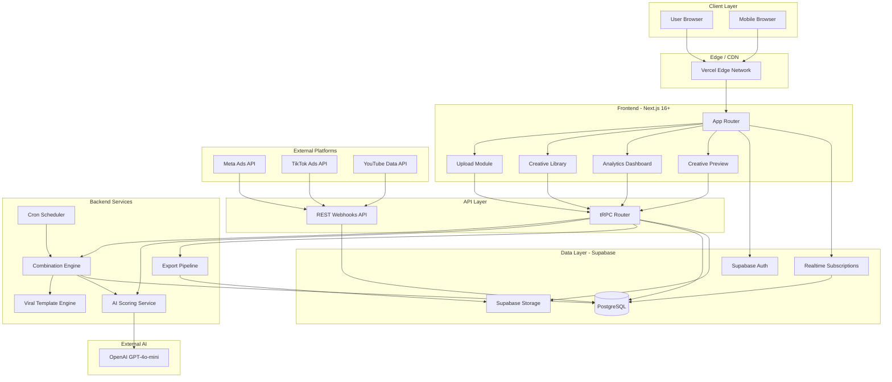
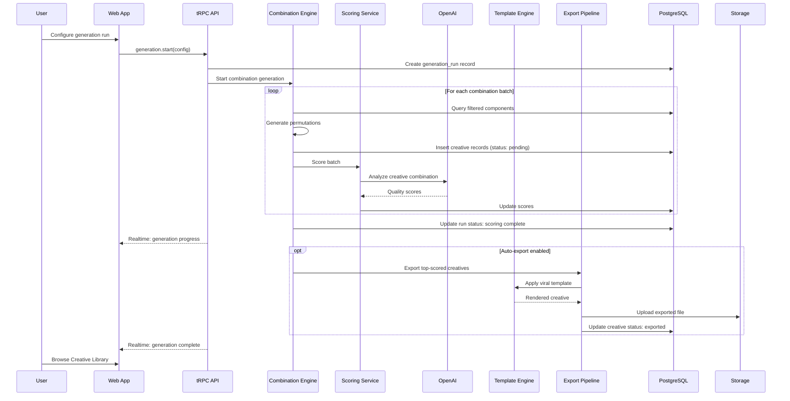
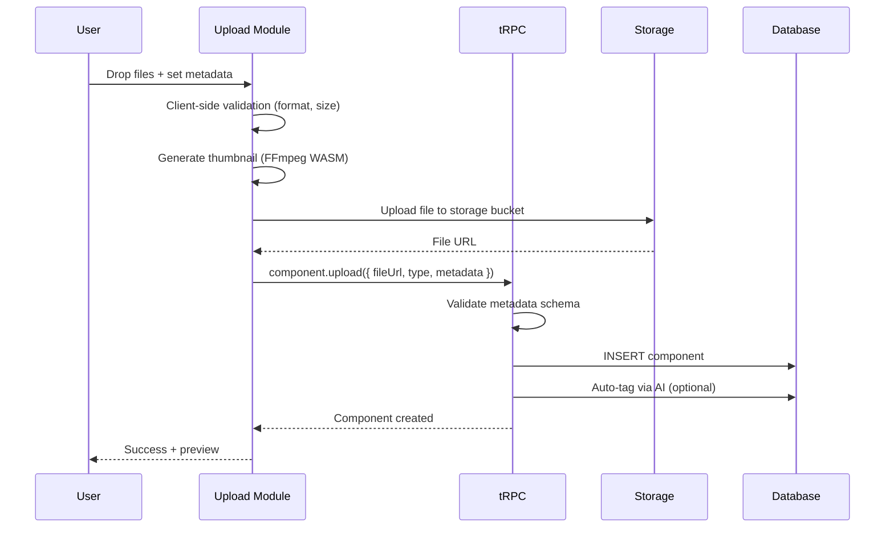
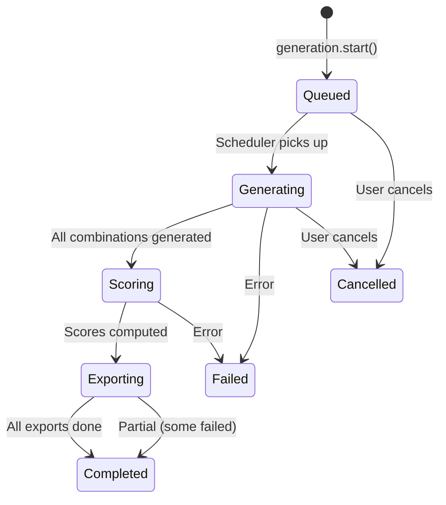
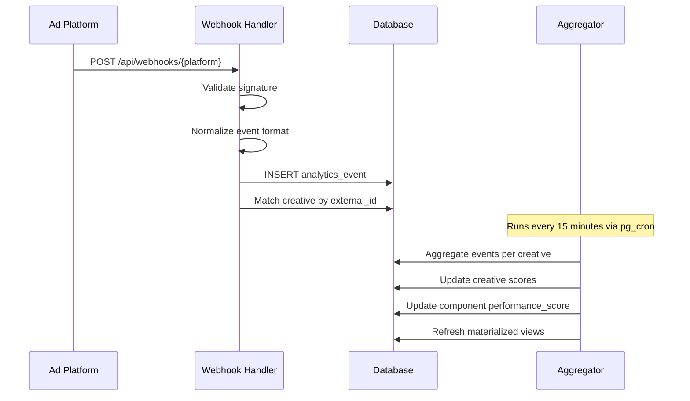
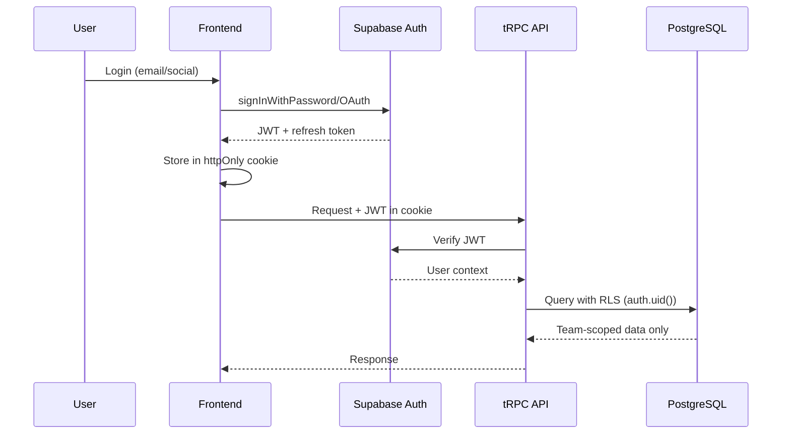

# Creative Growth Engine -- Fullstack Architecture Document

| Date | Version | Description | Author |
|------|---------|-------------|--------|
| 2026-03-10 | 1.0.0 | Initial architecture | Aria (Architect) |

---

## 1. Introduction

This document defines the complete fullstack architecture for the **Creative Growth Engine (CGE)** -- a high-throughput marketing creative production system capable of generating up to 300 unique creatives per day through combinatorial permutation of modular components (Hook, Development, CTA) layered with viral editing templates and scored by AI.

O sistema opera dentro do ecossistema AIOX, aproveitando agentes especializados para orquestrar o pipeline criativo. A arquitetura prioriza throughput, qualidade mensuravel e experiencia do usuario inspirada em design Apple.

**Starter Template:** N/A -- Greenfield project built on the `nextjs-react` tech preset.

---

## 2. High Level Architecture

### 2.1 Technical Summary

The Creative Growth Engine follows a serverless-first Jamstack architecture deployed on Vercel (frontend) with Supabase as the backend-as-a-service layer. The system uses a Next.js 16+ App Router frontend with a tRPC API layer for type-safe communication between the creative management UI and the permutation/scoring engine. Background creative generation runs as Vercel Cron + Supabase Edge Functions for heavy permutation workloads. AI scoring leverages OpenAI GPT-4o-mini for cost-effective creative quality assessment, with analytics collected from platform webhook integrations (Meta, TikTok, YouTube APIs).

### 2.2 Platform and Infrastructure

**Platform:** Vercel + Supabase
**Key Services:** Vercel (hosting, edge functions, cron jobs), Supabase (PostgreSQL, Auth, Storage, Edge Functions, Realtime)
**Deployment Regions:** US East (primary), EU West (secondary for latency)

Rationale: This combination delivers rapid iteration cycles, built-in auth/storage for creative assets, PostgreSQL for complex relational queries on creative performance data, and serverless scaling that handles bursty generation workloads without idle cost.

### 2.3 Repository Structure

**Structure:** Monorepo
**Monorepo Tool:** Turborepo
**Package Organization:** apps/ for deployable applications, packages/ for shared code

```
creative-growth-engine/
├── apps/
│   ├── web/                    # Next.js 16+ frontend (App Router)
│   └── engine/                 # Creative generation engine (Edge Functions)
├── packages/
│   ├── shared/                 # Shared types, constants, utils
│   ├── ui/                     # Design system components
│   ├── scoring/                # AI scoring module
│   └── config/                 # Shared ESLint, TS, Jest configs
├── supabase/                   # Supabase project (migrations, functions, seed)
│   ├── migrations/
│   ├── functions/
│   └── seed/
├── infrastructure/             # IaC (Vercel config, Supabase config)
├── scripts/                    # Build/deploy/seed scripts
├── docs/                       # Documentation
└── turbo.json
```

### 2.4 High Level Architecture Diagram



### 2.5 Architectural Patterns

- **Jamstack + Serverless:** Static generation for marketing pages, serverless functions for creative engine. _Rationale:_ Optimal cost-performance ratio; scale to zero when idle, burst during generation runs.
- **Component-Based UI with Atomic Design:** Reusable React components organized as atoms/molecules/organisms. _Rationale:_ Apple-inspired design system requires strict visual consistency.
- **Repository Pattern for Data Access:** Abstract all Supabase queries behind typed repository classes. _Rationale:_ Enables testing, caching, and future migration flexibility.
- **Event-Driven Pipeline:** Creative generation as a multi-stage pipeline with status events. _Rationale:_ Enables real-time progress tracking and retry on individual stages.
- **Strategy Pattern for Scoring:** Pluggable scoring algorithms (AI, heuristic, hybrid). _Rationale:_ A/B test different scoring approaches without pipeline changes.
- **CQRS-Lite:** Separate read models (analytics dashboards) from write models (creative generation). _Rationale:_ Analytics queries are heavy and should not block creative uploads.

---

## 3. Tech Stack

| Category | Technology | Version | Purpose | Rationale |
|----------|-----------|---------|---------|-----------|
| Frontend Language | TypeScript | 5.5+ | Type safety across stack | Shared types between FE/BE |
| Frontend Framework | Next.js | 16+ | App Router, RSC, SSR/SSG | Active preset, best DX for React |
| UI Component Library | shadcn/ui + Radix | latest | Accessible, composable primitives | Apple-minimal aesthetic, full customization |
| CSS Framework | Tailwind CSS | 4.0+ | Utility-first styling | Rapid iteration, design tokens |
| State Management | Zustand | 5.x | Global client state | Lightweight, TypeScript-native |
| Server State | TanStack Query | 5.x | Async state, caching, sync | Automatic refetch, optimistic updates |
| Backend Runtime | Node.js (Edge) | 22+ | Serverless functions | Vercel Edge/Supabase Edge Functions |
| API Style | tRPC | 11.x | Type-safe RPC | End-to-end type safety with Next.js |
| REST Webhooks | Next.js Route Handlers | - | External platform webhooks | Meta/TikTok/YouTube callback endpoints |
| Database | PostgreSQL | 15+ | Primary data store | Supabase-managed, RLS, full-text search |
| Cache | Vercel KV (Redis) | - | Hot data caching | Creative metadata, scoring cache |
| File Storage | Supabase Storage | - | Creative asset files | S3-compatible, CDN-backed, RLS |
| Authentication | Supabase Auth | - | User management, JWT | Built-in, social logins, team support |
| AI Scoring | OpenAI API | GPT-4o-mini | Creative quality scoring | Cost-effective at scale ($0.15/1M tokens) |
| Video Processing | FFmpeg (WASM) | 7.x | Client-side preview rendering | Browser-based preview without server load |
| Background Jobs | Vercel Cron + pg_cron | - | Scheduled generation runs | Serverless, no infrastructure to manage |
| Frontend Testing | Vitest | 2.x | Unit/component tests | Fast, ESM-native, compatible with React |
| E2E Testing | Playwright | 1.x | Browser testing | Cross-browser, visual regression |
| Backend Testing | Vitest | 2.x | API/service tests | Unified test runner |
| Build Tool | Turborepo | 2.x | Monorepo orchestration | Caching, parallel builds |
| CI/CD | GitHub Actions | - | Pipeline automation | Native GitHub integration |
| Monitoring | Vercel Analytics + Sentry | - | Performance + errors | Built-in for Vercel, deep error tracking |
| Logging | Axiom | - | Structured logging | Vercel-native, time-series queries |

---

## 4. Data Models

### 4.1 Core Entities

```mermaid
erDiagram
    USERS ||--o{ COMPONENTS : uploads
    USERS ||--o{ CREATIVES : generates
    USERS ||--o{ TEAMS : belongs_to
    TEAMS ||--o{ PROJECTS : owns
    PROJECTS ||--o{ COMPONENTS : contains
    PROJECTS ||--o{ CREATIVES : contains
    PROJECTS ||--o{ VIRAL_TEMPLATES : has
    COMPONENTS ||--o{ CREATIVE_COMPONENTS : used_in
    CREATIVES ||--o{ CREATIVE_COMPONENTS : composed_of
    CREATIVES ||--o{ ANALYTICS_EVENTS : tracked_by
    CREATIVES ||--|| VIRAL_TEMPLATES : uses
    GENERATION_RUNS ||--o{ CREATIVES : produces
    PROJECTS ||--o{ GENERATION_RUNS : triggers

    USERS {
        uuid id PK
        text email
        text full_name
        text avatar_url
        jsonb preferences
        timestamp created_at
    }

    TEAMS {
        uuid id PK
        text name
        text slug
        text plan
        int monthly_creative_limit
        timestamp created_at
    }

    PROJECTS {
        uuid id PK
        uuid team_id FK
        text name
        text description
        jsonb brand_guidelines
        text status
        timestamp created_at
    }

    COMPONENTS {
        uuid id PK
        uuid project_id FK
        uuid author_id FK
        text type
        text format
        text name
        text description
        text file_url
        text thumbnail_url
        jsonb metadata
        text[] tags
        float performance_score
        text status
        timestamp created_at
        timestamp updated_at
    }

    VIRAL_TEMPLATES {
        uuid id PK
        uuid project_id FK
        text name
        text platform
        text category
        jsonb template_config
        text preview_url
        float effectiveness_score
        text[] tags
        text status
        timestamp created_at
    }

    CREATIVES {
        uuid id PK
        uuid project_id FK
        uuid generation_run_id FK
        uuid hook_component_id FK
        uuid development_component_id FK
        uuid cta_component_id FK
        uuid viral_template_id FK
        text name
        float ai_score
        float hook_retention_score
        float development_engagement_score
        float cta_performance_score
        float composite_score
        text status
        text export_url
        jsonb export_metadata
        timestamp created_at
    }

    CREATIVE_COMPONENTS {
        uuid id PK
        uuid creative_id FK
        uuid component_id FK
        text slot
        int position
    }

    GENERATION_RUNS {
        uuid id PK
        uuid project_id FK
        uuid triggered_by FK
        text strategy
        int target_count
        int generated_count
        int scored_count
        int exported_count
        text status
        jsonb config
        timestamp started_at
        timestamp completed_at
    }

    ANALYTICS_EVENTS {
        uuid id PK
        uuid creative_id FK
        text platform
        text event_type
        jsonb event_data
        float metric_value
        timestamp recorded_at
    }
}
```

### 4.2 TypeScript Interfaces (packages/shared)

```typescript
// packages/shared/src/types/component.ts
export type ComponentType = 'HOOK' | 'DEVELOPMENT' | 'CTA';
export type ComponentFormat = 'video' | 'image' | 'text' | 'audio';
export type ComponentStatus = 'draft' | 'active' | 'archived';

export interface Component {
  id: string;
  projectId: string;
  authorId: string;
  type: ComponentType;
  format: ComponentFormat;
  name: string;
  description: string;
  fileUrl: string;
  thumbnailUrl: string | null;
  metadata: Record<string, unknown>;
  tags: string[];
  performanceScore: number;
  status: ComponentStatus;
  createdAt: Date;
  updatedAt: Date;
}

// packages/shared/src/types/creative.ts
export type CreativeStatus = 'pending' | 'scoring' | 'scored' | 'exporting' | 'exported' | 'failed';

export interface Creative {
  id: string;
  projectId: string;
  generationRunId: string;
  hookComponentId: string;
  developmentComponentId: string;
  ctaComponentId: string;
  viralTemplateId: string;
  name: string;
  aiScore: number;
  hookRetentionScore: number;
  developmentEngagementScore: number;
  ctaPerformanceScore: number;
  compositeScore: number;
  status: CreativeStatus;
  exportUrl: string | null;
  exportMetadata: Record<string, unknown> | null;
  createdAt: Date;
}

// packages/shared/src/types/generation-run.ts
export type GenerationStrategy = 'full_permutation' | 'smart_sample' | 'top_performers' | 'custom_rules';
export type RunStatus = 'queued' | 'generating' | 'scoring' | 'exporting' | 'completed' | 'failed' | 'cancelled';

export interface GenerationRun {
  id: string;
  projectId: string;
  triggeredBy: string;
  strategy: GenerationStrategy;
  targetCount: number;
  generatedCount: number;
  scoredCount: number;
  exportedCount: number;
  status: RunStatus;
  config: GenerationConfig;
  startedAt: Date;
  completedAt: Date | null;
}

export interface GenerationConfig {
  hookFilter?: { tags?: string[]; minScore?: number };
  developmentFilter?: { tags?: string[]; minScore?: number };
  ctaFilter?: { tags?: string[]; minScore?: number };
  templateFilter?: { platforms?: string[]; categories?: string[] };
  maxCombinations: number;
  scoreThreshold: number;
  autoExport: boolean;
}

// packages/shared/src/types/viral-template.ts
export type TemplatePlatform = 'tiktok' | 'instagram_reels' | 'youtube_shorts' | 'universal';

export interface ViralTemplate {
  id: string;
  projectId: string;
  name: string;
  platform: TemplatePlatform;
  category: string;
  templateConfig: TemplateConfig;
  previewUrl: string | null;
  effectivenessScore: number;
  tags: string[];
  status: 'active' | 'draft' | 'archived';
  createdAt: Date;
}

export interface TemplateConfig {
  duration: number;         // seconds
  aspectRatio: '9:16' | '1:1' | '16:9';
  transitions: TransitionDef[];
  textOverlays: TextOverlayDef[];
  musicSlot: boolean;
  hookTiming: { start: number; end: number };
  developmentTiming: { start: number; end: number };
  ctaTiming: { start: number; end: number };
}
```

---

## 5. API Specification

### 5.1 tRPC Router Definitions

```typescript
// apps/web/src/server/routers/_app.ts
import { router } from '../trpc';
import { componentRouter } from './component';
import { creativeRouter } from './creative';
import { generationRouter } from './generation';
import { analyticsRouter } from './analytics';
import { templateRouter } from './template';
import { projectRouter } from './project';

export const appRouter = router({
  component: componentRouter,
  creative: creativeRouter,
  generation: generationRouter,
  analytics: analyticsRouter,
  template: templateRouter,
  project: projectRouter,
});

export type AppRouter = typeof appRouter;
```

**Key Procedures:**

| Router | Procedure | Type | Description |
|--------|-----------|------|-------------|
| component | list | query | List components with filters (type, tags, score) |
| component | upload | mutation | Upload component with metadata classification |
| component | updateScore | mutation | Update performance score from analytics |
| component | bulkUpload | mutation | Upload multiple components |
| creative | list | query | List creatives with pagination, sorting |
| creative | getById | query | Get creative with all component details |
| creative | export | mutation | Trigger export for a creative |
| creative | bulkExport | mutation | Export multiple creatives |
| generation | start | mutation | Start a generation run |
| generation | status | query | Get run status with progress |
| generation | cancel | mutation | Cancel a running generation |
| generation | history | query | List past generation runs |
| analytics | dashboard | query | Aggregated analytics for project |
| analytics | creativePerformance | query | Per-creative performance metrics |
| analytics | componentRanking | query | Component ranking by performance |
| analytics | trends | query | Performance trends over time |
| template | list | query | List viral templates |
| template | create | mutation | Create/import viral template |
| template | preview | query | Generate template preview |

### 5.2 REST Webhook Endpoints

```
POST /api/webhooks/meta          # Meta Ads performance callbacks
POST /api/webhooks/tiktok        # TikTok Ads performance callbacks
POST /api/webhooks/youtube       # YouTube Analytics callbacks
POST /api/webhooks/custom        # Custom platform integrations
```

Cada webhook recebe performance data das plataformas e atualiza os scores dos criativos e componentes correspondentes via matching por `external_id` no metadata.

---

## 6. Components

### 6.1 Component List

**Upload Manager**
- **Responsibility:** Handle file uploads, metadata extraction, thumbnail generation, classification
- **Key Interfaces:** `uploadComponent()`, `bulkUpload()`, `validateFile()`
- **Dependencies:** Supabase Storage, FFmpeg WASM (thumbnails), tRPC
- **Technology:** React dropzone + Supabase Storage SDK

**Combination Engine**
- **Responsibility:** Generate creative permutations from component pool applying filters and constraints
- **Key Interfaces:** `generateCombinations(config)`, `estimateCount(config)`, `filterComponents()`
- **Dependencies:** PostgreSQL (component queries), Scoring Service
- **Technology:** Supabase Edge Function (Deno), streaming results

**AI Scoring Service**
- **Responsibility:** Score creative combinations using AI analysis and historical performance data
- **Key Interfaces:** `scoreSingle(creative)`, `scoreBatch(creatives[])`, `recalibrate()`
- **Dependencies:** OpenAI API, Analytics data, Component performance history
- **Technology:** packages/scoring module, OpenAI SDK

**Viral Template Engine**
- **Responsibility:** Apply editing templates to Hook+Dev+CTA combinations, generate preview renders
- **Key Interfaces:** `applyTemplate(creative, template)`, `renderPreview()`, `listTemplates()`
- **Dependencies:** FFmpeg WASM (preview), Template definitions, Supabase Storage
- **Technology:** Template DSL in JSON, client-side WASM rendering for previews

**Export Pipeline**
- **Responsibility:** Package final creatives for platform-specific export (format, resolution, aspect ratio)
- **Key Interfaces:** `exportCreative(id, platform)`, `bulkExport(ids[], platform)`, `getExportStatus()`
- **Dependencies:** Supabase Storage, Viral Template Engine, platform specs
- **Technology:** Edge Function for server-side rendering, Supabase Storage for output

**Analytics Aggregator**
- **Responsibility:** Collect, normalize, and aggregate performance data from multiple ad platforms
- **Key Interfaces:** `ingestEvent(webhook)`, `aggregateMetrics(creativeId)`, `computeTrends()`
- **Dependencies:** PostgreSQL, Webhook endpoints, Component/Creative repositories
- **Technology:** pg_cron for scheduled aggregation, materialized views for dashboards

**Creative Library**
- **Responsibility:** Browse, search, filter, and manage generated creatives
- **Key Interfaces:** React component tree with infinite scroll, filters, bulk actions
- **Dependencies:** tRPC queries, Zustand (local filters), TanStack Query (server state)
- **Technology:** Next.js RSC + Client Components, shadcn/ui DataTable

**Analytics Dashboard**
- **Responsibility:** Visualize performance metrics, trends, and rankings
- **Key Interfaces:** Charts, heatmaps, comparison views, export reports
- **Dependencies:** tRPC analytics router, Recharts/Tremor for visualization
- **Technology:** React Server Components for initial data, client for interactivity

### 6.2 Component Interaction Diagram



---

## 7. Core Workflows

### 7.1 Component Upload Flow



### 7.2 Creative Generation Flow (Batch 300/day Target)



### 7.3 Analytics Ingestion Flow



---

## 8. Database Schema

### 8.1 PostgreSQL DDL

```sql
-- Enable required extensions
CREATE EXTENSION IF NOT EXISTS "uuid-ossp";
CREATE EXTENSION IF NOT EXISTS "pg_trgm";  -- For fuzzy text search

-- Teams
CREATE TABLE teams (
    id UUID PRIMARY KEY DEFAULT uuid_generate_v4(),
    name TEXT NOT NULL,
    slug TEXT UNIQUE NOT NULL,
    plan TEXT NOT NULL DEFAULT 'free',
    monthly_creative_limit INT NOT NULL DEFAULT 1000,
    created_at TIMESTAMPTZ NOT NULL DEFAULT NOW(),
    updated_at TIMESTAMPTZ NOT NULL DEFAULT NOW()
);

-- Users (extends Supabase auth.users)
CREATE TABLE user_profiles (
    id UUID PRIMARY KEY REFERENCES auth.users(id) ON DELETE CASCADE,
    team_id UUID REFERENCES teams(id),
    full_name TEXT,
    avatar_url TEXT,
    role TEXT NOT NULL DEFAULT 'member',
    preferences JSONB DEFAULT '{}',
    created_at TIMESTAMPTZ NOT NULL DEFAULT NOW()
);

-- Projects
CREATE TABLE projects (
    id UUID PRIMARY KEY DEFAULT uuid_generate_v4(),
    team_id UUID NOT NULL REFERENCES teams(id) ON DELETE CASCADE,
    name TEXT NOT NULL,
    description TEXT,
    brand_guidelines JSONB DEFAULT '{}',
    status TEXT NOT NULL DEFAULT 'active',
    created_at TIMESTAMPTZ NOT NULL DEFAULT NOW(),
    updated_at TIMESTAMPTZ NOT NULL DEFAULT NOW()
);

CREATE INDEX idx_projects_team ON projects(team_id);

-- Components (HOOK | DEVELOPMENT | CTA)
CREATE TABLE components (
    id UUID PRIMARY KEY DEFAULT uuid_generate_v4(),
    project_id UUID NOT NULL REFERENCES projects(id) ON DELETE CASCADE,
    author_id UUID NOT NULL REFERENCES auth.users(id),
    type TEXT NOT NULL CHECK (type IN ('HOOK', 'DEVELOPMENT', 'CTA')),
    format TEXT NOT NULL CHECK (format IN ('video', 'image', 'text', 'audio')),
    name TEXT NOT NULL,
    description TEXT,
    file_url TEXT NOT NULL,
    thumbnail_url TEXT,
    metadata JSONB DEFAULT '{}',
    tags TEXT[] DEFAULT '{}',
    performance_score FLOAT DEFAULT 0.0,
    status TEXT NOT NULL DEFAULT 'active' CHECK (status IN ('draft', 'active', 'archived')),
    created_at TIMESTAMPTZ NOT NULL DEFAULT NOW(),
    updated_at TIMESTAMPTZ NOT NULL DEFAULT NOW()
);

CREATE INDEX idx_components_project ON components(project_id);
CREATE INDEX idx_components_type ON components(project_id, type);
CREATE INDEX idx_components_tags ON components USING GIN(tags);
CREATE INDEX idx_components_score ON components(project_id, performance_score DESC);
CREATE INDEX idx_components_status ON components(project_id, status) WHERE status = 'active';

-- Viral Templates
CREATE TABLE viral_templates (
    id UUID PRIMARY KEY DEFAULT uuid_generate_v4(),
    project_id UUID NOT NULL REFERENCES projects(id) ON DELETE CASCADE,
    name TEXT NOT NULL,
    platform TEXT NOT NULL CHECK (platform IN ('tiktok', 'instagram_reels', 'youtube_shorts', 'universal')),
    category TEXT NOT NULL,
    template_config JSONB NOT NULL,
    preview_url TEXT,
    effectiveness_score FLOAT DEFAULT 0.0,
    tags TEXT[] DEFAULT '{}',
    status TEXT NOT NULL DEFAULT 'active' CHECK (status IN ('draft', 'active', 'archived')),
    created_at TIMESTAMPTZ NOT NULL DEFAULT NOW()
);

CREATE INDEX idx_viral_templates_project ON viral_templates(project_id);
CREATE INDEX idx_viral_templates_platform ON viral_templates(project_id, platform);

-- Generation Runs
CREATE TABLE generation_runs (
    id UUID PRIMARY KEY DEFAULT uuid_generate_v4(),
    project_id UUID NOT NULL REFERENCES projects(id) ON DELETE CASCADE,
    triggered_by UUID NOT NULL REFERENCES auth.users(id),
    strategy TEXT NOT NULL CHECK (strategy IN ('full_permutation', 'smart_sample', 'top_performers', 'custom_rules')),
    target_count INT NOT NULL,
    generated_count INT NOT NULL DEFAULT 0,
    scored_count INT NOT NULL DEFAULT 0,
    exported_count INT NOT NULL DEFAULT 0,
    status TEXT NOT NULL DEFAULT 'queued' CHECK (status IN ('queued', 'generating', 'scoring', 'exporting', 'completed', 'failed', 'cancelled')),
    config JSONB NOT NULL DEFAULT '{}',
    started_at TIMESTAMPTZ,
    completed_at TIMESTAMPTZ,
    created_at TIMESTAMPTZ NOT NULL DEFAULT NOW()
);

CREATE INDEX idx_generation_runs_project ON generation_runs(project_id);
CREATE INDEX idx_generation_runs_status ON generation_runs(status) WHERE status IN ('queued', 'generating', 'scoring', 'exporting');

-- Creatives (generated combinations)
CREATE TABLE creatives (
    id UUID PRIMARY KEY DEFAULT uuid_generate_v4(),
    project_id UUID NOT NULL REFERENCES projects(id) ON DELETE CASCADE,
    generation_run_id UUID REFERENCES generation_runs(id),
    hook_component_id UUID NOT NULL REFERENCES components(id),
    development_component_id UUID NOT NULL REFERENCES components(id),
    cta_component_id UUID NOT NULL REFERENCES components(id),
    viral_template_id UUID REFERENCES viral_templates(id),
    name TEXT NOT NULL,
    ai_score FLOAT DEFAULT 0.0,
    hook_retention_score FLOAT DEFAULT 0.0,
    development_engagement_score FLOAT DEFAULT 0.0,
    cta_performance_score FLOAT DEFAULT 0.0,
    composite_score FLOAT DEFAULT 0.0,
    status TEXT NOT NULL DEFAULT 'pending' CHECK (status IN ('pending', 'scoring', 'scored', 'exporting', 'exported', 'failed')),
    export_url TEXT,
    export_metadata JSONB,
    created_at TIMESTAMPTZ NOT NULL DEFAULT NOW(),
    -- Prevent duplicate combinations within a project
    UNIQUE(project_id, hook_component_id, development_component_id, cta_component_id, viral_template_id)
);

CREATE INDEX idx_creatives_project ON creatives(project_id);
CREATE INDEX idx_creatives_run ON creatives(generation_run_id);
CREATE INDEX idx_creatives_composite_score ON creatives(project_id, composite_score DESC);
CREATE INDEX idx_creatives_status ON creatives(status);
CREATE INDEX idx_creatives_hook ON creatives(hook_component_id);
CREATE INDEX idx_creatives_development ON creatives(development_component_id);
CREATE INDEX idx_creatives_cta ON creatives(cta_component_id);

-- Analytics Events
CREATE TABLE analytics_events (
    id UUID PRIMARY KEY DEFAULT uuid_generate_v4(),
    creative_id UUID NOT NULL REFERENCES creatives(id) ON DELETE CASCADE,
    platform TEXT NOT NULL,
    event_type TEXT NOT NULL,
    event_data JSONB DEFAULT '{}',
    metric_value FLOAT,
    recorded_at TIMESTAMPTZ NOT NULL DEFAULT NOW()
);

CREATE INDEX idx_analytics_creative ON analytics_events(creative_id);
CREATE INDEX idx_analytics_platform ON analytics_events(platform, event_type);
CREATE INDEX idx_analytics_recorded ON analytics_events(recorded_at DESC);

-- Materialized View: Component Performance Aggregation
CREATE MATERIALIZED VIEW component_performance AS
SELECT
    c.id AS component_id,
    c.type,
    c.project_id,
    COUNT(DISTINCT cr.id) AS usage_count,
    AVG(cr.composite_score) AS avg_creative_score,
    AVG(CASE WHEN c.type = 'HOOK' THEN cr.hook_retention_score END) AS avg_type_score,
    AVG(CASE WHEN c.type = 'DEVELOPMENT' THEN cr.development_engagement_score END) AS avg_dev_score,
    AVG(CASE WHEN c.type = 'CTA' THEN cr.cta_performance_score END) AS avg_cta_score,
    MAX(cr.composite_score) AS best_creative_score
FROM components c
LEFT JOIN creatives cr ON
    c.id = cr.hook_component_id OR
    c.id = cr.development_component_id OR
    c.id = cr.cta_component_id
GROUP BY c.id, c.type, c.project_id;

CREATE UNIQUE INDEX idx_component_perf_id ON component_performance(component_id);

-- Materialized View: Daily Analytics Summary
CREATE MATERIALIZED VIEW daily_analytics AS
SELECT
    DATE(ae.recorded_at) AS date,
    cr.project_id,
    ae.platform,
    COUNT(*) AS event_count,
    AVG(ae.metric_value) AS avg_metric,
    SUM(CASE WHEN ae.event_type = 'impression' THEN 1 ELSE 0 END) AS impressions,
    SUM(CASE WHEN ae.event_type = 'view_3s' THEN 1 ELSE 0 END) AS views_3s,
    SUM(CASE WHEN ae.event_type = 'watch_through' THEN 1 ELSE 0 END) AS watch_throughs,
    SUM(CASE WHEN ae.event_type = 'click' THEN 1 ELSE 0 END) AS clicks,
    SUM(CASE WHEN ae.event_type = 'conversion' THEN 1 ELSE 0 END) AS conversions
FROM analytics_events ae
JOIN creatives cr ON ae.creative_id = cr.id
GROUP BY DATE(ae.recorded_at), cr.project_id, ae.platform;

CREATE UNIQUE INDEX idx_daily_analytics ON daily_analytics(date, project_id, platform);

-- RLS Policies
ALTER TABLE user_profiles ENABLE ROW LEVEL SECURITY;
ALTER TABLE teams ENABLE ROW LEVEL SECURITY;
ALTER TABLE projects ENABLE ROW LEVEL SECURITY;
ALTER TABLE components ENABLE ROW LEVEL SECURITY;
ALTER TABLE viral_templates ENABLE ROW LEVEL SECURITY;
ALTER TABLE generation_runs ENABLE ROW LEVEL SECURITY;
ALTER TABLE creatives ENABLE ROW LEVEL SECURITY;
ALTER TABLE analytics_events ENABLE ROW LEVEL SECURITY;

-- Policy: Users can only access their own team's data
CREATE POLICY "team_isolation" ON projects
    FOR ALL USING (
        team_id IN (SELECT team_id FROM user_profiles WHERE id = auth.uid())
    );

CREATE POLICY "team_isolation" ON components
    FOR ALL USING (
        project_id IN (
            SELECT p.id FROM projects p
            JOIN user_profiles up ON p.team_id = up.team_id
            WHERE up.id = auth.uid()
        )
    );

-- (Similar RLS policies for all tables - delegate detailed implementation to @data-engineer)

-- pg_cron: Refresh materialized views every 15 minutes
SELECT cron.schedule('refresh-component-perf', '*/15 * * * *', 'REFRESH MATERIALIZED VIEW CONCURRENTLY component_performance');
SELECT cron.schedule('refresh-daily-analytics', '*/15 * * * *', 'REFRESH MATERIALIZED VIEW CONCURRENTLY daily_analytics');
```

---

## 9. Agent Squad

O Creative Growth Engine opera com um squad AIOX especializado:

| Agent | Persona | Scope | Key Commands |
|-------|---------|-------|-------------|
| **@cge-lead** | Leo (Orchestrator) | Squad lead, pipeline orchestration, cross-agent coordination | `*run-generation`, `*squad-status`, `*pipeline-health` |
| **@cge-uploader** | Uma (Curator) | Component upload, validation, metadata extraction, tagging | `*upload`, `*bulk-upload`, `*validate-components`, `*auto-tag` |
| **@cge-combinator** | Max (Alchemist) | Permutation logic, filtering, combination strategy | `*generate`, `*estimate`, `*configure-strategy` |
| **@cge-scorer** | Nova (Analyst) | AI scoring, score calibration, performance prediction | `*score-batch`, `*calibrate`, `*explain-score` |
| **@cge-exporter** | Rex (Producer) | Template application, rendering, platform-specific export | `*export`, `*bulk-export`, `*render-preview` |
| **@cge-analytics** | Sage (Tracker) | Analytics ingestion, aggregation, reporting, insights | `*dashboard`, `*trends`, `*ranking`, `*ingest-webhooks` |

**Squad Configuration:**

```yaml
# squads/creative-growth-engine/squad.yaml
squad:
  id: creative-growth-engine
  name: Creative Growth Engine
  lead: cge-lead
  agents:
    - cge-lead
    - cge-uploader
    - cge-combinator
    - cge-scorer
    - cge-exporter
    - cge-analytics
  workflow: pipeline
  pipeline_order:
    - cge-uploader      # Phase 1: Content ingestion
    - cge-combinator    # Phase 2: Combination generation
    - cge-scorer        # Phase 3: Quality scoring
    - cge-exporter      # Phase 4: Template + export
    - cge-analytics     # Phase 5: Performance tracking
```

---

## 10. CLI Tools

Seguindo o principio CLI First da Constitution:

| Tool | Command | Description |
|------|---------|-------------|
| Generate | `aiox cge generate --project <id> --strategy smart_sample --target 300` | Start a generation run |
| Upload | `aiox cge upload --project <id> --type HOOK --file ./assets/hook1.mp4` | Upload a component |
| Bulk Upload | `aiox cge upload --project <id> --dir ./assets/ --auto-classify` | Bulk upload with AI classification |
| Score | `aiox cge score --run <id>` | Re-score a generation run |
| Export | `aiox cge export --run <id> --platform tiktok --top 50` | Export top N creatives |
| Analytics | `aiox cge analytics --project <id> --range 7d` | Show analytics summary |
| Dashboard | `aiox cge dashboard --project <id>` | Open analytics dashboard URL |
| Template Import | `aiox cge template import --file ./templates/trending.json` | Import viral template |
| Status | `aiox cge status --run <id>` | Show generation run status |
| Estimate | `aiox cge estimate --project <id> --strategy full_permutation` | Estimate combination count |

---

## 11. Scaling Strategy: Reaching 300 Creatives/Day

### 11.1 Capacity Analysis

Para atingir 300 criativos/dia, o sistema precisa gerar, pontuar e exportar combinacoes de forma eficiente.

**Mathematical Foundation:**

```
Given:
  H = number of HOOK components
  D = number of DEVELOPMENT components
  C = number of CTA components
  T = number of viral templates

  Total possible combinations = H x D x C x T

Example:
  10 hooks x 10 developments x 5 CTAs x 6 templates = 3,000 possible combinations
  Target: 300/day = top 10% by AI score
```

### 11.2 Generation Strategies

| Strategy | Description | Use Case |
|----------|-------------|----------|
| `full_permutation` | Generate ALL possible combinations | Small component pools (< 500 total) |
| `smart_sample` | Statistical sampling with diversity constraints | Large pools, daily generation |
| `top_performers` | Only combine top-scoring components | Optimization phase |
| `custom_rules` | User-defined constraints (tags, scores, formats) | Campaign-specific runs |

### 11.3 Pipeline Optimization

```
Phase 1: Combination Generation
├── Batch size: 50 combinations per Edge Function invocation
├── Parallelism: 6 concurrent Edge Function instances
├── Throughput: 300 combinations in ~60 seconds
└── Deduplication: UNIQUE constraint prevents duplicate combos

Phase 2: AI Scoring
├── Batch size: 20 creatives per OpenAI API call
├── Model: GPT-4o-mini (fast, cost-effective)
├── Parallelism: 5 concurrent API calls
├── Throughput: 300 scores in ~90 seconds
├── Cost: ~$0.05 per 300 creatives ($1.50/month at daily runs)
└── Fallback: Heuristic scoring if AI unavailable

Phase 3: Export
├── Only export creatives above score threshold
├── Batch rendering via Edge Functions
├── Platform-specific format conversion
├── CDN-backed storage for instant delivery
└── Typical: 50-100 exports from 300 scored (top 30%)

Total Pipeline Time: ~5-8 minutes for 300 creatives
```

### 11.4 Scaling Limits

| Metric | Current Design | Scale Point | Migration Path |
|--------|---------------|-------------|----------------|
| Creatives/day | 300 | 5,000 | Add dedicated worker (BullMQ on Railway) |
| Components | 10,000 | 100,000 | Partition by project, add search index |
| Analytics events/day | 50,000 | 1M+ | Move to ClickHouse or TimescaleDB |
| Concurrent users | 50 | 500 | Already serverless, add Redis caching |
| Storage | 100GB | 1TB | Supabase Storage auto-scales |

---

## 12. Analytics Architecture

### 12.1 Data Collection

```
                    ┌──────────────┐
                    │  Ad Platform  │
                    │ (Meta/TikTok/ │
                    │  YouTube)     │
                    └──────┬───────┘
                           │ Webhook POST
                           v
                    ┌──────────────┐
                    │  Webhook      │
                    │  Handler      │
                    │  (REST API)   │
                    └──────┬───────┘
                           │ Validate + Normalize
                           v
                    ┌──────────────┐
                    │ analytics_   │
                    │ events table │
                    └──────┬───────┘
                           │ pg_cron (every 15 min)
                           v
                ┌──────────────────────┐
                │ Materialized Views   │
                │ - component_perf     │
                │ - daily_analytics    │
                └──────────┬───────────┘
                           │
                           v
                    ┌──────────────┐
                    │  Dashboard   │
                    │  (tRPC query)│
                    └──────────────┘
```

### 12.2 Scoring Models

**AI Score (Pre-deployment):** Scored by GPT-4o-mini analyzing the combination quality.

```typescript
// packages/scoring/src/ai-scorer.ts
interface ScoringPrompt {
  hook: { type: string; description: string; tags: string[]; historicalScore: number };
  development: { type: string; description: string; tags: string[]; historicalScore: number };
  cta: { type: string; description: string; tags: string[]; historicalScore: number };
  template: { platform: string; category: string; effectivenessScore: number };
}

interface ScoringResult {
  overallScore: number;          // 0-100
  hookRetentionPrediction: number;    // 0-1 (predicted 0-3s view rate)
  developmentEngagementPrediction: number; // 0-1 (predicted watch-through rate)
  ctaConversionPrediction: number;    // 0-1 (predicted click rate)
  reasoning: string;
  confidenceLevel: 'high' | 'medium' | 'low';
}
```

**Composite Score (Post-deployment):** Weighted blend of AI prediction + real performance.

```
composite_score = (
    0.3 * hook_retention_score +
    0.4 * development_engagement_score +
    0.3 * cta_performance_score
)

-- With AI calibration:
final_score = (0.6 * real_composite) + (0.4 * ai_predicted_score)
-- Weight shifts toward real data as more analytics arrive
```

**Platform-Specific Metrics:**

| Metric | Source | Measurement | Creative Layer |
|--------|--------|-------------|---------------|
| Hook Retention | 0-3s view rate | `views_3s / impressions` | HOOK |
| Development Engagement | Watch-through rate | `watch_throughs / views_3s` | DEVELOPMENT |
| CTA Performance | Click rate | `clicks / watch_throughs` | CTA |
| Conversion Rate | Conversion rate | `conversions / clicks` | Full Creative |
| Template Effectiveness | Aggregate per template | `AVG(composite_score) per template` | TEMPLATE |

### 12.3 Feedback Loop

O sistema implementa um loop de melhoria continua:

```
1. Generate creatives (AI-scored)
       ↓
2. Deploy to ad platforms
       ↓
3. Collect real performance data (webhooks)
       ↓
4. Update component performance_score
       ↓
5. Recalibrate AI scoring model weights
       ↓
6. Next generation run uses updated scores
       ↓
7. Smart sampling favors proven components
       ↓
8. Creative quality improves over time
```

---

## 13. Frontend Architecture

### 13.1 Component Organization

```
apps/web/src/
├── app/                          # Next.js App Router
│   ├── (auth)/                   # Auth group
│   │   ├── login/
│   │   └── signup/
│   ├── (dashboard)/              # Dashboard group (protected)
│   │   ├── layout.tsx            # Dashboard shell
│   │   ├── page.tsx              # Overview
│   │   ├── components/           # Component library page
│   │   │   ├── page.tsx
│   │   │   └── upload/
│   │   ├── creatives/            # Creative library page
│   │   │   ├── page.tsx
│   │   │   └── [id]/
│   │   ├── generate/             # Generation config page
│   │   │   └── page.tsx
│   │   ├── templates/            # Viral templates page
│   │   │   └── page.tsx
│   │   ├── analytics/            # Analytics dashboard
│   │   │   ├── page.tsx
│   │   │   ├── performance/
│   │   │   └── trends/
│   │   └── settings/
│   ├── api/                      # Route handlers
│   │   ├── trpc/[trpc]/
│   │   └── webhooks/
│   └── layout.tsx
├── components/                   # Shared components
│   ├── ui/                       # shadcn/ui primitives
│   ├── creative/                 # Creative-specific components
│   │   ├── creative-card.tsx
│   │   ├── creative-grid.tsx
│   │   ├── creative-preview.tsx
│   │   └── score-badge.tsx
│   ├── upload/                   # Upload components
│   │   ├── dropzone.tsx
│   │   ├── metadata-form.tsx
│   │   └── bulk-upload-wizard.tsx
│   ├── analytics/                # Analytics components
│   │   ├── score-chart.tsx
│   │   ├── performance-heatmap.tsx
│   │   └── trend-line.tsx
│   └── layout/                   # Layout components
│       ├── sidebar.tsx
│       ├── header.tsx
│       └── command-palette.tsx
├── hooks/                        # Custom hooks
│   ├── use-generation.ts
│   ├── use-components.ts
│   └── use-analytics.ts
├── stores/                       # Zustand stores
│   ├── generation-store.ts
│   ├── filter-store.ts
│   └── ui-store.ts
├── services/                     # tRPC client
│   └── trpc.ts
└── lib/                          # Utilities
    ├── utils.ts
    ├── scoring.ts
    └── format.ts
```

### 13.2 Design System: Apple-Minimal

```typescript
// packages/ui/src/design-tokens.ts
export const tokens = {
  colors: {
    background: 'hsl(0, 0%, 100%)',
    foreground: 'hsl(0, 0%, 3.9%)',
    muted: 'hsl(0, 0%, 96.1%)',
    accent: 'hsl(240, 5.9%, 10%)',
    primary: 'hsl(0, 0%, 9%)',        // Near-black primary
    secondary: 'hsl(0, 0%, 96.1%)',
    success: 'hsl(142, 71%, 45%)',
    warning: 'hsl(48, 96%, 53%)',
    destructive: 'hsl(0, 84.2%, 60.2%)',
  },
  spacing: {
    page: '2rem',                      // Generous padding
    section: '3rem',                   // Between sections
    card: '1.5rem',                    // Card internal padding
  },
  typography: {
    fontFamily: '"SF Pro Display", "Inter", system-ui, sans-serif',
    heading: { weight: 600, tracking: '-0.02em' },
    body: { weight: 400, tracking: '0' },
    caption: { weight: 400, tracking: '0.01em', color: 'muted-foreground' },
  },
  animation: {
    duration: '200ms',
    easing: 'cubic-bezier(0.25, 0.1, 0.25, 1)',
    hover: 'scale(1.02)',
    press: 'scale(0.98)',
  },
  radius: {
    sm: '0.5rem',
    md: '0.75rem',
    lg: '1rem',
    xl: '1.5rem',
  },
} as const;
```

### 13.3 State Management

```typescript
// stores/generation-store.ts
import { create } from 'zustand';
import type { GenerationConfig, RunStatus } from '@cge/shared';

interface GenerationState {
  activeRunId: string | null;
  runStatus: RunStatus | null;
  progress: { generated: number; scored: number; exported: number; total: number };
  config: GenerationConfig;
  setConfig: (config: Partial<GenerationConfig>) => void;
  startRun: (runId: string) => void;
  updateProgress: (progress: Partial<GenerationState['progress']>) => void;
  reset: () => void;
}

export const useGenerationStore = create<GenerationState>()((set) => ({
  activeRunId: null,
  runStatus: null,
  progress: { generated: 0, scored: 0, exported: 0, total: 0 },
  config: {
    maxCombinations: 300,
    scoreThreshold: 60,
    autoExport: true,
  },
  setConfig: (config) => set((state) => ({ config: { ...state.config, ...config } })),
  startRun: (runId) => set({ activeRunId: runId, runStatus: 'queued' }),
  updateProgress: (progress) => set((state) => ({ progress: { ...state.progress, ...progress } })),
  reset: () => set({ activeRunId: null, runStatus: null, progress: { generated: 0, scored: 0, exported: 0, total: 0 } }),
}));
```

---

## 14. Backend Architecture

### 14.1 Service Architecture (Serverless)

```
supabase/functions/
├── generate-combinations/    # Edge Function: combination engine
│   └── index.ts
├── score-batch/              # Edge Function: AI scoring
│   └── index.ts
├── export-creative/          # Edge Function: render + export
│   └── index.ts
├── ingest-webhook/           # Edge Function: webhook processing
│   └── index.ts
└── refresh-analytics/        # Edge Function: materialized view refresh
    └── index.ts

apps/web/src/server/
├── trpc.ts                   # tRPC initialization
├── context.ts                # Request context (auth, db)
├── routers/                  # tRPC routers
│   ├── _app.ts
│   ├── component.ts
│   ├── creative.ts
│   ├── generation.ts
│   ├── analytics.ts
│   ├── template.ts
│   └── project.ts
└── services/                 # Business logic
    ├── combination.service.ts
    ├── scoring.service.ts
    ├── export.service.ts
    └── analytics.service.ts
```

### 14.2 Authentication and Authorization



**Authorization Layers:**
1. **Supabase Auth:** JWT-based authentication
2. **RLS Policies:** Team-level data isolation at database level
3. **tRPC Middleware:** Role-based access control (admin, editor, viewer)
4. **API Rate Limiting:** Per-team rate limits on generation runs

---

## 15. Security and Performance

### 15.1 Security Requirements

**Frontend Security:**
- CSP Headers: Strict policy allowing only self, Vercel, Supabase domains
- XSS Prevention: React auto-escaping + DOMPurify for user content
- Secure Storage: JWT in httpOnly cookies, never localStorage

**Backend Security:**
- Input Validation: Zod schemas on all tRPC inputs
- Rate Limiting: Vercel Edge Middleware (100 req/min per user, 10 generation runs/hour)
- CORS Policy: Strict origin allowlist (production domain only)
- File Upload: Type validation, size limits (100MB video, 10MB image), virus scan via ClamAV

**Authentication Security:**
- Token Storage: httpOnly secure cookies with SameSite=Strict
- Session Management: Supabase auto-refresh, 1-hour JWT expiry
- Password Policy: Minimum 8 chars, breach database check via HaveIBeenPwned API

**Data Security:**
- RLS on all tables: Team-level isolation
- Encrypted at rest: Supabase default (AES-256)
- Encrypted in transit: TLS 1.3 everywhere
- API keys: Environment variables only, never client-side
- OpenAI API key: Server-side only, Edge Function environment

### 15.2 Performance Targets

| Metric | Target | Measurement |
|--------|--------|-------------|
| Page Load (LCP) | < 2.5s | Core Web Vitals |
| Time to Interactive | < 3.5s | Lighthouse |
| API Response (p95) | < 500ms | Vercel Analytics |
| Generation Pipeline | < 8 min for 300 | Custom metric |
| Creative Preview Render | < 2s | Client-side metric |
| Dashboard Data Load | < 1s | tRPC timing |
| Upload (single file) | < 5s for 100MB | Client-side metric |

**Optimization Strategies:**
- Frontend: Code splitting per route, image optimization via next/image, ISR for template gallery
- Backend: Connection pooling (Supabase Pooler), batch DB operations, streaming responses
- Caching: Vercel KV for hot component metadata, stale-while-revalidate for analytics
- CDN: All creative assets served via Supabase Storage CDN

---

## 16. Testing Strategy

```
            E2E Tests (Playwright)
           /                      \
      Integration Tests (tRPC + DB)
         /                        \
   Frontend Unit (Vitest)    Backend Unit (Vitest)
```

| Layer | Tool | Coverage Target | Focus |
|-------|------|----------------|-------|
| Frontend Unit | Vitest + Testing Library | 80% | Components, hooks, stores |
| Backend Unit | Vitest | 85% | Services, scoring logic, combination engine |
| Integration | Vitest + Supabase local | 70% | tRPC routers, DB queries, RLS |
| E2E | Playwright | Critical paths | Upload, generate, export, analytics view |

**Critical E2E Paths:**
1. User signs up, creates project, uploads components
2. User configures and runs generation (full pipeline)
3. User views analytics dashboard with real data
4. Webhook ingestion updates creative scores
5. User exports top creatives for platform

---

## 17. Development Workflow

### 17.1 Prerequisites

```bash
node --version   # >= 22.0
pnpm --version   # >= 9.0
supabase --version  # >= 1.200
```

### 17.2 Setup

```bash
# Clone and install
git clone <repo-url> && cd creative-growth-engine
pnpm install

# Start Supabase locally
supabase start
supabase db push  # Apply migrations

# Start all services
pnpm dev          # Turborepo: web + supabase functions

# Individual services
pnpm --filter web dev           # Frontend only
pnpm --filter engine dev        # Engine functions only
supabase functions serve        # Edge Functions locally
```

### 17.3 Environment Variables

```bash
# apps/web/.env.local
NEXT_PUBLIC_SUPABASE_URL=http://localhost:54321
NEXT_PUBLIC_SUPABASE_ANON_KEY=<local-anon-key>
SUPABASE_SERVICE_ROLE_KEY=<local-service-role-key>
OPENAI_API_KEY=sk-...

# supabase/.env
OPENAI_API_KEY=sk-...
```

---

## 18. Deployment Architecture

| Environment | Frontend URL | Backend URL | Purpose |
|-------------|-------------|-------------|---------|
| Development | localhost:3000 | localhost:54321 | Local development |
| Staging | staging.cge.app | staging-db.supabase.co | Pre-production testing |
| Production | app.cge.app | prod-db.supabase.co | Live environment |

**CI/CD Pipeline:**

```yaml
# .github/workflows/ci.yaml
name: CI
on: [push, pull_request]
jobs:
  lint-and-type:
    runs-on: ubuntu-latest
    steps:
      - uses: actions/checkout@v4
      - uses: pnpm/action-setup@v4
      - run: pnpm install --frozen-lockfile
      - run: pnpm lint
      - run: pnpm typecheck

  test:
    runs-on: ubuntu-latest
    steps:
      - uses: actions/checkout@v4
      - uses: supabase/setup-cli@v1
      - run: supabase start
      - run: pnpm install --frozen-lockfile
      - run: pnpm test

  deploy-preview:
    if: github.event_name == 'pull_request'
    needs: [lint-and-type, test]
    runs-on: ubuntu-latest
    steps:
      - uses: actions/checkout@v4
      - uses: amondnet/vercel-action@v25
        with:
          vercel-token: ${{ secrets.VERCEL_TOKEN }}

  deploy-production:
    if: github.ref == 'refs/heads/main'
    needs: [lint-and-type, test]
    runs-on: ubuntu-latest
    steps:
      - uses: actions/checkout@v4
      - uses: amondnet/vercel-action@v25
        with:
          vercel-token: ${{ secrets.VERCEL_TOKEN }}
          vercel-args: '--prod'
      - run: supabase db push --linked
```

---

## 19. Error Handling Strategy

```typescript
// packages/shared/src/types/error.ts
interface ApiError {
  error: {
    code: string;
    message: string;
    details?: Record<string, unknown>;
    timestamp: string;
    requestId: string;
  };
}

// Error codes
const ERROR_CODES = {
  GENERATION_LIMIT_REACHED: 'CGE-001',
  SCORING_SERVICE_UNAVAILABLE: 'CGE-002',
  EXPORT_FAILED: 'CGE-003',
  INVALID_COMPONENT_FORMAT: 'CGE-004',
  DUPLICATE_COMBINATION: 'CGE-005',
  WEBHOOK_VALIDATION_FAILED: 'CGE-006',
  OPENAI_RATE_LIMITED: 'CGE-007',
  STORAGE_QUOTA_EXCEEDED: 'CGE-008',
} as const;
```

**Resilience Patterns:**
- **AI Scoring Fallback:** If OpenAI is unavailable, use heuristic scoring (weighted component scores)
- **Generation Retry:** Failed batches retry 3x with exponential backoff
- **Webhook Idempotency:** Deduplicate by event ID, process-once semantics
- **Partial Export:** If some exports fail, mark individually; do not fail entire run

---

## 20. Monitoring and Observability

| Layer | Tool | Metrics |
|-------|------|---------|
| Frontend | Vercel Analytics | Core Web Vitals, page views, edge latency |
| Errors | Sentry | JS errors, API errors, source maps |
| Backend | Vercel Logs + Axiom | Function duration, cold starts, errors |
| Database | Supabase Dashboard | Query performance, connection count, storage |
| Business | Custom Dashboard | Creatives/day, scores, component utilization |
| AI | OpenAI Usage Dashboard | Token usage, cost, latency |

**Key Alerts:**

| Alert | Condition | Severity |
|-------|-----------|----------|
| Generation pipeline stalled | Run status unchanged > 30 min | HIGH |
| AI scoring error rate | > 10% failures in 5 min | HIGH |
| Storage approaching limit | > 80% quota | MEDIUM |
| Webhook processing delay | Queue depth > 1000 | MEDIUM |
| Daily creative target missed | < 200 creatives by 18:00 | LOW |

---

## 21. Coding Standards

### Critical Rules

- **Type Sharing:** Always define types in `packages/shared` and import from `@cge/shared`
- **API Calls:** Never make direct Supabase calls from components -- use tRPC procedures
- **Environment Variables:** Access only through config objects, never `process.env` directly in components
- **Error Handling:** All tRPC procedures must use the standard error middleware
- **State Updates:** Never mutate Zustand state directly -- use setter functions
- **File Uploads:** Always validate type + size client-side AND server-side
- **AI Calls:** Never call OpenAI from frontend -- all AI operations are server-side
- **Scoring:** Never display raw AI scores to users -- always use normalized 0-100 scale

### Naming Conventions

| Element | Frontend | Backend | Example |
|---------|----------|---------|---------|
| Components | PascalCase | - | `CreativeCard.tsx` |
| Hooks | camelCase with 'use' | - | `useGeneration.ts` |
| Stores | camelCase with 'Store' | - | `generationStore.ts` |
| API Routes | - | kebab-case | `/api/webhooks/meta` |
| tRPC Procedures | camelCase | camelCase | `creative.getById` |
| Database Tables | - | snake_case | `generation_runs` |
| Database Columns | - | snake_case | `composite_score` |
| Edge Functions | - | kebab-case dirs | `generate-combinations/` |

---

-- Aria, arquitetando o futuro
