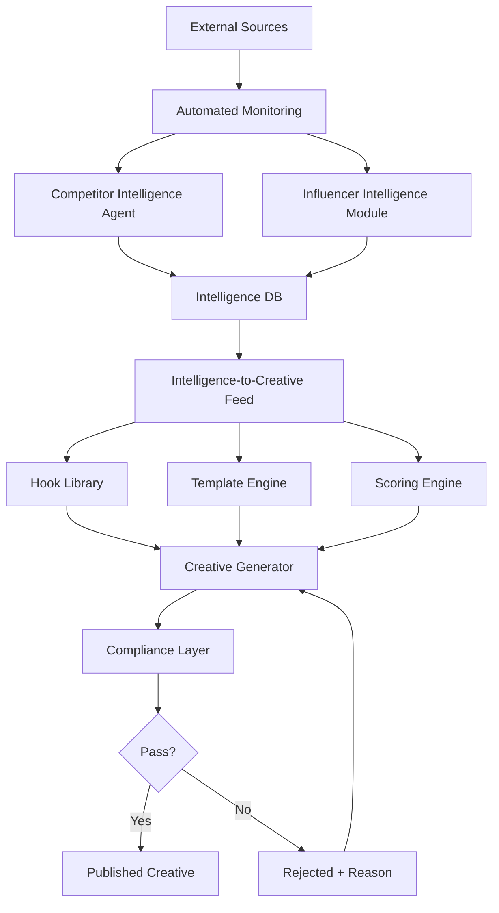
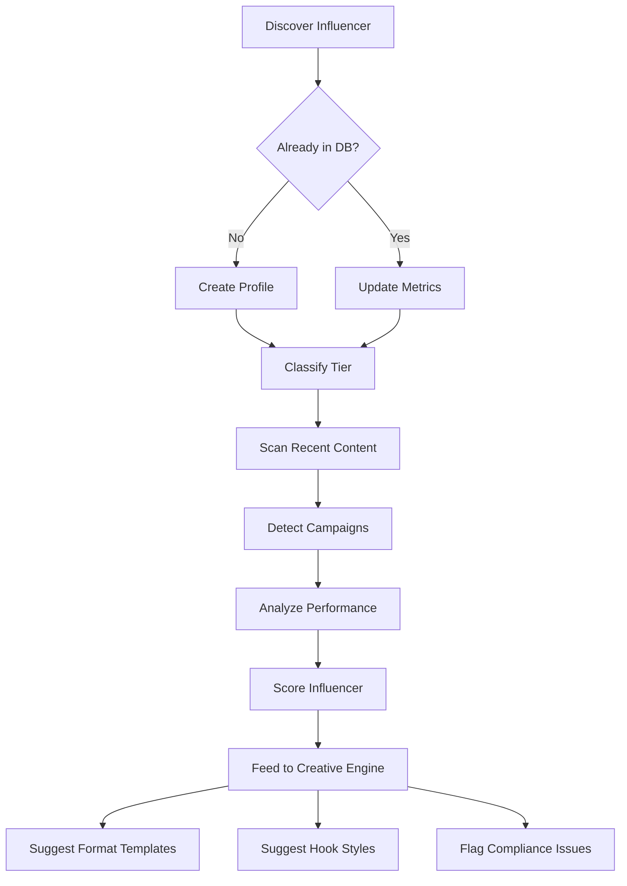

# Niche Intelligence Layer -- iGaming / Betting / Casino

**Version:** 1.0.0
**Author:** Aria (Architect Agent)
**Date:** 2026-03-10
**Status:** DRAFT -- Pending PO/User Validation
**Parent Architecture:** Creative Growth Engine (General)

---

## Table of Contents

1. [Executive Summary](#1-executive-summary)
2. [System Context Diagram](#2-system-context-diagram)
3. [Competitor Intelligence Agent](#3-competitor-intelligence-agent)
4. [Intelligence Pipeline](#4-intelligence-pipeline)
5. [Database Extensions](#5-database-extensions)
6. [Viral Format Catalog](#6-viral-format-catalog)
7. [Influencer Intelligence Module](#7-influencer-intelligence-module)
8. [Compliance & Legal Layer](#8-compliance--legal-layer)
9. [Automated Monitoring](#9-automated-monitoring)
10. [Intelligence-to-Creative Feed](#10-intelligence-to-creative-feed)
11. [Trade-off Analysis](#11-trade-off-analysis)
12. [Security Considerations](#12-security-considerations)
13. [Appendix: Glossary](#appendix-glossary)

---

## 1. Executive Summary

Este documento especifica a expansao arquitetural do Creative Growth Engine para o nicho de iGaming (apostas online e cassinos). A camada Niche Intelligence Layer adiciona inteligencia competitiva, catalogo de formatos virais especificos, modulo de influenciadores e -- criticamente -- uma camada de compliance que impoe regras regulatorias no nivel de geracao criativa.

**Principios Arquiteturais:**

| Principio | Aplicacao |
|-----------|-----------|
| CLI First | Todos os pipelines executaveis via CLI antes de qualquer UI |
| Compliance by Design | Regras regulatorias embutidas no pipeline de geracao, nao como pos-processamento |
| Data-Centric | Inteligencia competitiva direciona decisoes criativas via dados, nao intuicao |
| Progressive Complexity | Comeca com monitoramento manual, escala para automacao |
| Zero Coupling | Modulo de nicho e expansion pack independente do motor criativo generico |

---

## 2. System Context Diagram

```
┌─────────────────────────────────────────────────────────────────────────┐
│                     CREATIVE GROWTH ENGINE (General)                    │
│                                                                         │
│  ┌──────────────┐  ┌──────────────┐  ┌──────────────┐  ┌────────────┐  │
│  │ Hook Library  │  │  Template    │  │  Scoring     │  │  Creative  │  │
│  │              │  │  Engine      │  │  Engine      │  │  Generator │  │
│  └──────┬───────┘  └──────┬───────┘  └──────┬───────┘  └──────┬─────┘  │
│         │                 │                 │                 │         │
│  ───────┼─────────────────┼─────────────────┼─────────────────┼──────── │
│         │     NICHE INTELLIGENCE LAYER (iGaming)              │         │
│  ┌──────▼───────────────────────────────────────────────▼─────────────┐ │
│  │                                                                     │ │
│  │  ┌─────────────────┐  ┌─────────────────┐  ┌───────────────────┐  │ │
│  │  │  Competitor      │  │  Viral Format   │  │  Influencer       │  │ │
│  │  │  Intelligence    │  │  Catalog        │  │  Intelligence     │  │ │
│  │  │  Agent           │  │  (iGaming)      │  │  Module           │  │ │
│  │  └────────┬─────────┘  └────────┬────────┘  └────────┬──────────┘  │ │
│  │           │                     │                     │             │ │
│  │  ┌────────▼─────────────────────▼─────────────────────▼──────────┐  │ │
│  │  │              COMPLIANCE & LEGAL LAYER                          │  │ │
│  │  │  ┌──────────┐ ┌──────────┐ ┌──────────┐ ┌──────────────────┐ │  │ │
│  │  │  │ Age Gate │ │ Jurisd.  │ │ Resp.    │ │ Disclosure       │ │  │ │
│  │  │  │ Rules    │ │ Filter   │ │ Gambling │ │ Requirements     │ │  │ │
│  │  │  └──────────┘ └──────────┘ └──────────┘ └──────────────────┘ │  │ │
│  │  └───────────────────────────────────────────────────────────────┘  │ │
│  │                                                                     │ │
│  │  ┌─────────────────────────────────────────────────────────────┐   │ │
│  │  │              AUTOMATED MONITORING                           │   │ │
│  │  │  Cron Jobs | Webhooks | Scraping Orchestrator               │   │ │
│  │  └─────────────────────────────────────────────────────────────┘   │ │
│  └─────────────────────────────────────────────────────────────────────┘ │
└─────────────────────────────────────────────────────────────────────────┘
```

### Data Flow (Mermaid)



---

## 3. Competitor Intelligence Agent

### 3.1 Agent Definition

| Attribute | Value |
|-----------|-------|
| **Name** | Scout |
| **ID** | competitor-intel |
| **Title** | Competitor Intelligence Analyst |
| **Archetype** | Observer |
| **Scope** | iGaming competitive landscape monitoring and analysis |
| **Delegates To** | @analyst (deep research), @architect (strategic decisions) |

### 3.2 Tier Classification Model

```
┌─────────────────────────────────────────────────────────────┐
│                  COMPETITOR TIERS                            │
├─────────────────────────────────────────────────────────────┤
│                                                             │
│  TIER 1 — Global Operators                                  │
│  ┌─────────┐ ┌───────────┐ ┌─────────┐ ┌─────────────┐    │
│  │ Bet365  │ │DraftKings │ │ FanDuel │ │  888Casino  │    │
│  └─────────┘ └───────────┘ └─────────┘ └─────────────┘    │
│  Budget: $50M+/yr | Platforms: ALL | Influencers: Mega     │
│                                                             │
│  TIER 2 — Regional Operators                                │
│  ┌──────────┐ ┌────────┐ ┌─────────┐ ┌─────────────┐      │
│  │Betano BR │ │ Pixbet │ │Novibet  │ │  Betfair    │      │
│  └──────────┘ └────────┘ └─────────┘ └─────────────┘      │
│  Budget: $5-50M/yr | Platforms: Regional focus | Macro     │
│                                                             │
│  TIER 3 — Affiliates & Niche Players                        │
│  ┌──────────────┐ ┌──────────────┐ ┌───────────────────┐  │
│  │ Local sites  │ │  Streamers   │ │ Micro-brands     │  │
│  │ (aff links)  │ │ (own brand)  │ │ (niche games)    │  │
│  └──────────────┘ └──────────────┘ └───────────────────┘  │
│  Budget: <$5M/yr | Platforms: 1-2 | Micro/Nano            │
│                                                             │
└─────────────────────────────────────────────────────────────┘
```

### 3.3 Per-Competitor Analysis Dimensions

| Dimension | Data Points | Collection Method |
|-----------|-------------|-------------------|
| **Creative Formats** | Video length, hook type (question, shock, testimonial), CTA style (swipe up, link in bio, promo code), thumbnail patterns | Meta Ads Library API, TikTok Creative Center, manual catalog |
| **Platform Distribution** | Presence on TikTok, Instagram, YouTube, Twitch, X; posting frequency per platform; engagement rates per platform | Social media APIs, Apify scrapers |
| **Influencer Partnerships** | Partner list, tier (mega/macro/micro/nano), contract type (one-shot, ambassador), exclusivity | Manual tracking, social listening, disclosure scraping |
| **Promotional Mechanics** | Free bet, deposit match, cashback, no-risk first bet, odds boost, referral bonus | Ad library monitoring, landing page scraping |
| **Posting Patterns** | Frequency (posts/week), timing (hour/day), seasonal patterns (match days, events) | Historical data aggregation |
| **Estimated Ad Spend** | Meta Ads Library transparency data, TikTok Creative Center volume, SimilarWeb estimates | API queries, third-party tools |

### 3.4 Agent Commands

| Command | Description |
|---------|-------------|
| `*scan-competitor {name}` | Full analysis of a single competitor |
| `*scan-tier {1\|2\|3}` | Batch scan all competitors in a tier |
| `*compare {comp1} {comp2}` | Side-by-side comparison of two competitors |
| `*trending-hooks` | Extract trending hooks from recent competitor creatives |
| `*promo-radar` | Scan current promotional mechanics across all tiers |
| `*spend-estimate {name}` | Estimate ad spend for a competitor |
| `*alert-config` | Configure competitive alerts (new campaign, spend spike, new influencer) |

### 3.5 Agent Tools

| Tool | Purpose |
|------|---------|
| Apify (via docker-gateway) | Social media scraping (Instagram, TikTok) |
| EXA (via docker-gateway) | Web search for competitor campaigns |
| Meta Ads Library API | Facebook/Instagram ad transparency |
| TikTok Creative Center API | TikTok ad intelligence |
| SimilarWeb API | Traffic and spend estimates |
| Internal DB | Store and query intelligence data |

---

## 4. Intelligence Pipeline

### 4.1 Pipeline Architecture

```
┌──────────────┐    ┌──────────────┐    ┌──────────────┐    ┌──────────────┐
│   COLLECT    │───▶│   PROCESS    │───▶│   ANALYZE    │───▶│    FEED      │
│              │    │              │    │              │    │              │
│ - Scrape ads │    │ - Normalize  │    │ - Trend      │    │ - Hook lib   │
│ - API calls  │    │ - Classify   │    │   detection  │    │ - Templates  │
│ - Webhooks   │    │ - Dedupe     │    │ - Scoring    │    │ - Weights    │
│ - Manual     │    │ - Enrich     │    │ - Alerts     │    │ - CTAs       │
└──────────────┘    └──────────────┘    └──────────────┘    └──────────────┘
       │                   │                   │                   │
       ▼                   ▼                   ▼                   ▼
  raw_intel_*         processed_intel     intel_insights      creative_feed
  (staging)           (normalized)        (analyzed)          (actionable)
```

### 4.2 Pipeline Stages Detail

**Stage 1: COLLECT**
- Scheduled scrapers (cron) pull from Meta Ads Library, TikTok Creative Center
- Apify Actors scrape competitor social profiles (Instagram, TikTok, YouTube)
- Webhooks receive alerts from monitoring services (brand mentions, new campaigns)
- Manual intake via CLI: `*ingest-creative {url}` for ad-hoc additions

**Stage 2: PROCESS**
- Normalize data into standard schema (see Section 5)
- Classify creative by format (video, image, carousel, story)
- Detect hook type via NLP/pattern matching (question, shock value, testimonial, educational)
- Deduplicate across sources (same creative found in Meta Ads Library and manual scrape)
- Enrich with metadata: competitor tier, platform, estimated reach

**Stage 3: ANALYZE**
- Trend detection: identify rising hooks, declining formats, emerging mechanics
- Scoring: assign virality score based on engagement metrics vs. baseline
- Alert generation: spike in competitor spend, new influencer partnership, new promotional mechanic
- Cohort analysis: performance by tier, by platform, by format

**Stage 4: FEED**
- Push trending hooks to Hook Library with source attribution
- Generate template suggestions from winning creative structures
- Adjust scoring weights in the Scoring Engine based on market trends
- Suggest CTA templates from detected promotional mechanics

### 4.3 Pipeline Execution Model

| Execution Mode | Trigger | Frequency |
|----------------|---------|-----------|
| **Scheduled** | Cron job | Daily (Tier 1), Weekly (Tier 2), Bi-weekly (Tier 3) |
| **Event-driven** | Webhook / alert | Real-time on competitor campaign launch |
| **Manual** | CLI command | On-demand via `*scan-competitor` or `*promo-radar` |
| **Batch** | CLI command | Monthly full re-scan via `*scan-tier` |

---

## 5. Database Extensions

### 5.1 Entity Relationship Diagram

```
┌──────────────────┐     ┌──────────────────┐     ┌──────────────────┐
│   competitors    │     │ competitor_      │     │ competitor_      │
│                  │     │ creatives        │     │ promotions       │
│ id (PK)          │     │                  │     │                  │
│ name             │◄────│ competitor_id FK │     │ competitor_id FK │
│ tier (1|2|3)     │     │ id (PK)          │     │ id (PK)          │
│ region           │     │ platform         │     │ mechanic_type    │
│ website          │     │ format_type      │     │ name             │
│ status           │     │ hook_type        │     │ value            │
│ estimated_spend  │     │ cta_style        │     │ currency         │
│ created_at       │     │ video_length_sec │     │ conditions       │
│ updated_at       │     │ engagement_rate  │     │ start_date       │
└──────────────────┘     │ views_count      │     │ end_date         │
         │               │ source_url       │     │ landing_page_url │
         │               │ captured_at      │     │ created_at       │
         │               │ virality_score   │     └──────────────────┘
         │               │ compliance_flags │
         │               │ created_at       │
         │               └──────────────────┘
         │
         │               ┌──────────────────┐     ┌──────────────────┐
         │               │ competitor_      │     │ competitor_      │
         └──────────────▶│ platforms        │     │ influencers      │
                         │                  │     │                  │
                         │ competitor_id FK │     │ competitor_id FK │
                         │ platform_name    │     │ influencer_id FK │──┐
                         │ handle           │     │ campaign_type    │  │
                         │ followers_count  │     │ contract_type    │  │
                         │ avg_engagement   │     │ start_date       │  │
                         │ posting_freq     │     │ end_date         │  │
                         │ best_time_slot   │     │ created_at       │  │
                         │ last_scanned_at  │     └──────────────────┘  │
                         │ created_at       │                           │
                         └──────────────────┘                           │
                                                                        │
┌──────────────────┐     ┌──────────────────┐     ┌──────────────────┐  │
│   influencers    │     │ influencer_      │     │ influencer_      │  │
│                  │     │ campaigns        │     │ content          │  │
│ id (PK)          │◄────│                  │     │                  │  │
│ name             │  │  │ influencer_id FK │     │ influencer_id FK │  │
│ tier             │  │  │ id (PK)          │     │ id (PK)          │  │
│  (mega|macro|    │  │  │ brand_name       │     │ platform         │  │
│   micro|nano)    │  │  │ campaign_name    │     │ content_url      │  │
│ primary_platform │  │  │ disclosure_style │     │ format_type      │  │
│ total_followers  │  │  │ cta_type         │     │ hook_type        │  │
│ avg_engagement   │  │  │ conversion_mech  │     │ engagement_rate  │  │
│ niche_focus      │  │  │ estimated_value  │     │ views_count      │  │
│  (sports|casino| │  │  │ performance_     │     │ virality_score   │  │
│   crash|slots)   │  │  │   score          │     │ posted_at        │  │
│ region           │  │  │ start_date       │     │ captured_at      │  │
│ status           │  │  │ end_date         │     │ created_at       │  │
│ created_at       │  │  │ created_at       │     └──────────────────┘  │
│ updated_at       │  │  └──────────────────┘                           │
└──────────────────┘  │                                                  │
                      └──────────────────────────────────────────────────┘

┌──────────────────┐     ┌──────────────────┐
│ viral_formats    │     │ compliance_      │
│                  │     │ rules            │
│ id (PK)          │     │                  │
│ name             │     │ id (PK)          │
│ category         │     │ jurisdiction     │
│  (sports|casino| │     │ rule_type        │
│   crash|slots|   │     │  (age_gate|      │
│   generic)       │     │   disclaimer|    │
│ description      │     │   timing|        │
│ hook_pattern     │     │   content_ban|   │
│ structure_json   │     │   disclosure)    │
│ example_urls[]   │     │ rule_text        │
│ avg_engagement   │     │ enforcement_     │
│ best_platforms[] │     │   level          │
│ compliance_reqs[]│     │  (BLOCK|WARN|    │
│ status           │     │   FLAG)          │
│ created_at       │     │ applies_to[]     │
│ updated_at       │     │  (creative_type) │
└──────────────────┘     │ active           │
                         │ effective_date   │
┌──────────────────┐     │ expiry_date      │
│ intel_insights   │     │ source_url       │
│                  │     │ created_at       │
│ id (PK)          │     └──────────────────┘
│ insight_type     │
│  (trending_hook| │     ┌──────────────────┐
│   format_shift|  │     │ intel_feed_log   │
│   spend_spike|   │     │                  │
│   new_mechanic|  │     │ id (PK)          │
│   new_partner)   │     │ insight_id FK    │
│ title            │     │ target_module    │
│ description      │     │  (hook_library|  │
│ data_json        │     │   template_eng|  │
│ confidence       │     │   scoring_eng|   │
│  (0.0 - 1.0)    │     │   cta_templates) │
│ competitor_ids[] │     │ action_taken     │
│ source_count     │     │  (auto_added|    │
│ first_detected   │     │   suggested|     │
│ last_confirmed   │     │   rejected)      │
│ status           │     │ created_at       │
│  (active|stale|  │     └──────────────────┘
│   archived)      │
│ created_at       │
└──────────────────┘
```

### 5.2 Table Definitions

#### `competitors`

```sql
CREATE TABLE competitors (
    id              UUID PRIMARY KEY DEFAULT gen_random_uuid(),
    name            TEXT NOT NULL,
    tier            SMALLINT NOT NULL CHECK (tier IN (1, 2, 3)),
    region          TEXT NOT NULL,           -- 'BR', 'US', 'UK', 'EU', 'GLOBAL'
    website         TEXT,
    logo_url        TEXT,
    status          TEXT NOT NULL DEFAULT 'active'
                    CHECK (status IN ('active', 'inactive', 'watchlist')),
    estimated_annual_spend_usd  NUMERIC(12,2),
    meta_ads_page_id            TEXT,       -- Facebook Page ID for Ads Library
    tiktok_handle               TEXT,
    notes           TEXT,
    created_at      TIMESTAMPTZ NOT NULL DEFAULT now(),
    updated_at      TIMESTAMPTZ NOT NULL DEFAULT now()
);

CREATE INDEX idx_competitors_tier ON competitors(tier);
CREATE INDEX idx_competitors_region ON competitors(region);
```

#### `competitor_creatives`

```sql
CREATE TABLE competitor_creatives (
    id              UUID PRIMARY KEY DEFAULT gen_random_uuid(),
    competitor_id   UUID NOT NULL REFERENCES competitors(id) ON DELETE CASCADE,
    platform        TEXT NOT NULL
                    CHECK (platform IN ('tiktok', 'instagram', 'youtube',
                                        'twitch', 'facebook', 'x', 'other')),
    format_type     TEXT NOT NULL
                    CHECK (format_type IN ('video', 'image', 'carousel',
                                           'story', 'reel', 'short', 'live')),
    hook_type       TEXT
                    CHECK (hook_type IN ('question', 'shock', 'testimonial',
                                         'educational', 'challenge', 'reveal',
                                         'reaction', 'comparison', 'other')),
    cta_style       TEXT
                    CHECK (cta_style IN ('swipe_up', 'link_in_bio', 'promo_code',
                                         'download_app', 'visit_site', 'dm',
                                         'comment', 'other')),
    video_length_sec    INTEGER,
    thumbnail_url       TEXT,
    source_url          TEXT NOT NULL,
    caption_text        TEXT,
    hashtags            TEXT[],
    views_count         BIGINT,
    likes_count         BIGINT,
    comments_count      INTEGER,
    shares_count        INTEGER,
    engagement_rate     NUMERIC(5,4),       -- 0.0000 to 9.9999
    virality_score      NUMERIC(5,2),       -- Calculated score 0-100
    compliance_flags    TEXT[],             -- e.g. ['missing_disclaimer', 'no_age_gate']
    viral_format_id     UUID REFERENCES viral_formats(id),
    captured_at         TIMESTAMPTZ NOT NULL,
    posted_at           TIMESTAMPTZ,
    created_at          TIMESTAMPTZ NOT NULL DEFAULT now()
);

CREATE INDEX idx_comp_creatives_competitor ON competitor_creatives(competitor_id);
CREATE INDEX idx_comp_creatives_platform ON competitor_creatives(platform);
CREATE INDEX idx_comp_creatives_hook ON competitor_creatives(hook_type);
CREATE INDEX idx_comp_creatives_captured ON competitor_creatives(captured_at DESC);
CREATE INDEX idx_comp_creatives_virality ON competitor_creatives(virality_score DESC);
```

#### `competitor_promotions`

```sql
CREATE TABLE competitor_promotions (
    id              UUID PRIMARY KEY DEFAULT gen_random_uuid(),
    competitor_id   UUID NOT NULL REFERENCES competitors(id) ON DELETE CASCADE,
    mechanic_type   TEXT NOT NULL
                    CHECK (mechanic_type IN ('free_bet', 'deposit_match',
                                              'cashback', 'no_risk_bet',
                                              'odds_boost', 'referral_bonus',
                                              'free_spins', 'welcome_package',
                                              'loyalty_program', 'other')),
    name            TEXT NOT NULL,
    value_amount    NUMERIC(10,2),
    value_currency  TEXT DEFAULT 'BRL',
    conditions_text TEXT,                   -- "Deposito minimo R$50, odds min 1.5"
    min_deposit     NUMERIC(10,2),
    max_payout      NUMERIC(10,2),
    wagering_req    NUMERIC(5,1),           -- e.g. 35.0x
    landing_page_url TEXT,
    start_date      DATE,
    end_date        DATE,
    is_evergreen    BOOLEAN DEFAULT false,
    source_url      TEXT,
    created_at      TIMESTAMPTZ NOT NULL DEFAULT now()
);

CREATE INDEX idx_comp_promos_competitor ON competitor_promotions(competitor_id);
CREATE INDEX idx_comp_promos_mechanic ON competitor_promotions(mechanic_type);
```

#### `influencers`

```sql
CREATE TABLE influencers (
    id              UUID PRIMARY KEY DEFAULT gen_random_uuid(),
    name            TEXT NOT NULL,
    tier            TEXT NOT NULL
                    CHECK (tier IN ('mega', 'macro', 'micro', 'nano')),
    primary_platform TEXT NOT NULL
                    CHECK (primary_platform IN ('tiktok', 'instagram', 'youtube',
                                                 'twitch', 'x', 'other')),
    handle_tiktok       TEXT,
    handle_instagram    TEXT,
    handle_youtube      TEXT,
    handle_twitch       TEXT,
    total_followers     BIGINT NOT NULL,
    avg_engagement_rate NUMERIC(5,4),
    niche_focus         TEXT[]
                        -- ['sports_betting', 'casino_slots', 'crash_games',
                        --  'live_dealer', 'poker', 'general_igaming']
    ,
    region              TEXT NOT NULL,
    audience_age_range  TEXT,               -- '18-25', '25-34', etc.
    audience_gender_split TEXT,             -- 'M70_F30'
    content_style       TEXT,               -- 'educational', 'entertainment', 'hybrid'
    status              TEXT NOT NULL DEFAULT 'active'
                        CHECK (status IN ('active', 'inactive', 'blacklisted')),
    notes               TEXT,
    created_at          TIMESTAMPTZ NOT NULL DEFAULT now(),
    updated_at          TIMESTAMPTZ NOT NULL DEFAULT now()
);

CREATE INDEX idx_influencers_tier ON influencers(tier);
CREATE INDEX idx_influencers_platform ON influencers(primary_platform);
CREATE INDEX idx_influencers_followers ON influencers(total_followers DESC);
```

#### `influencer_campaigns`

```sql
CREATE TABLE influencer_campaigns (
    id              UUID PRIMARY KEY DEFAULT gen_random_uuid(),
    influencer_id   UUID NOT NULL REFERENCES influencers(id) ON DELETE CASCADE,
    competitor_id   UUID REFERENCES competitors(id),
    brand_name      TEXT NOT NULL,
    campaign_name   TEXT,
    disclosure_style TEXT
                    CHECK (disclosure_style IN ('hashtag_ad', 'hashtag_publi',
                                                 'paid_partnership_tag',
                                                 'verbal_disclosure',
                                                 'none_detected', 'other')),
    cta_type        TEXT
                    CHECK (cta_type IN ('promo_code', 'link_in_bio', 'swipe_up',
                                        'app_download', 'direct_signup', 'other')),
    conversion_mechanic TEXT,               -- 'promo_code_XPTO', 'aff_link_123'
    promo_code          TEXT,
    estimated_value_usd NUMERIC(10,2),
    content_count       INTEGER DEFAULT 0,
    avg_performance_score NUMERIC(5,2),     -- 0-100 based on engagement vs baseline
    start_date      DATE,
    end_date        DATE,
    status          TEXT DEFAULT 'active'
                    CHECK (status IN ('active', 'completed', 'cancelled')),
    created_at      TIMESTAMPTZ NOT NULL DEFAULT now()
);

CREATE INDEX idx_inf_campaigns_influencer ON influencer_campaigns(influencer_id);
CREATE INDEX idx_inf_campaigns_competitor ON influencer_campaigns(competitor_id);
```

#### `viral_formats`

```sql
CREATE TABLE viral_formats (
    id              UUID PRIMARY KEY DEFAULT gen_random_uuid(),
    name            TEXT NOT NULL UNIQUE,
    slug            TEXT NOT NULL UNIQUE,    -- 'big-win-reveal', 'bonus-hunt'
    category        TEXT NOT NULL
                    CHECK (category IN ('sports_betting', 'casino_slots',
                                        'crash_games', 'live_dealer',
                                        'poker', 'generic_igaming')),
    description     TEXT NOT NULL,
    hook_pattern    TEXT NOT NULL,           -- Pattern description for hook detection
    structure_json  JSONB NOT NULL,          -- Full format structure (see 6.2)
    example_urls    TEXT[],
    avg_engagement_rate NUMERIC(5,4),
    best_platforms  TEXT[],                  -- ['tiktok', 'youtube']
    optimal_length_sec  INT4RANGE,          -- '[15,60]' or '[120,600]'
    compliance_requirements TEXT[],         -- ['responsible_gambling_disclaimer',
                                            --  'age_gate', '18_plus_warning']
    status          TEXT DEFAULT 'active'
                    CHECK (status IN ('active', 'deprecated', 'experimental')),
    usage_count     INTEGER DEFAULT 0,
    last_seen_at    TIMESTAMPTZ,
    created_at      TIMESTAMPTZ NOT NULL DEFAULT now(),
    updated_at      TIMESTAMPTZ NOT NULL DEFAULT now()
);

CREATE INDEX idx_viral_formats_category ON viral_formats(category);
CREATE INDEX idx_viral_formats_engagement ON viral_formats(avg_engagement_rate DESC);
```

#### `compliance_rules`

```sql
CREATE TABLE compliance_rules (
    id              UUID PRIMARY KEY DEFAULT gen_random_uuid(),
    jurisdiction    TEXT NOT NULL,           -- 'BR', 'UK', 'US_NJ', 'EU', 'GLOBAL'
    rule_type       TEXT NOT NULL
                    CHECK (rule_type IN ('age_gate', 'disclaimer',
                                          'timing_restriction', 'content_ban',
                                          'disclosure_requirement',
                                          'responsible_gambling',
                                          'odds_display', 'bonus_terms',
                                          'celebrity_restriction')),
    rule_code       TEXT NOT NULL UNIQUE,    -- 'BR_AGE_18', 'UK_ASA_RESP_GAMB'
    rule_text       TEXT NOT NULL,
    enforcement_level TEXT NOT NULL
                    CHECK (enforcement_level IN ('BLOCK', 'WARN', 'FLAG')),
    applies_to      TEXT[] NOT NULL,        -- ['video', 'image', 'influencer_content']
    validation_pattern TEXT,                -- Regex or keyword pattern for auto-check
    penalty_description TEXT,
    source_authority TEXT,                  -- 'CONAR', 'ASA', 'UKGC', 'SRD'
    source_url      TEXT,
    active          BOOLEAN NOT NULL DEFAULT true,
    effective_date  DATE NOT NULL,
    expiry_date     DATE,
    created_at      TIMESTAMPTZ NOT NULL DEFAULT now()
);

CREATE INDEX idx_compliance_jurisdiction ON compliance_rules(jurisdiction);
CREATE INDEX idx_compliance_type ON compliance_rules(rule_type);
CREATE INDEX idx_compliance_active ON compliance_rules(active) WHERE active = true;
```

#### `intel_insights`

```sql
CREATE TABLE intel_insights (
    id              UUID PRIMARY KEY DEFAULT gen_random_uuid(),
    insight_type    TEXT NOT NULL
                    CHECK (insight_type IN ('trending_hook', 'format_shift',
                                            'spend_spike', 'new_mechanic',
                                            'new_partnership', 'declining_format',
                                            'compliance_violation_detected')),
    title           TEXT NOT NULL,
    description     TEXT,
    data_json       JSONB,                  -- Structured insight data
    confidence      NUMERIC(3,2) NOT NULL   -- 0.00 to 1.00
                    CHECK (confidence >= 0 AND confidence <= 1),
    competitor_ids  UUID[],
    source_count    INTEGER DEFAULT 1,
    first_detected  TIMESTAMPTZ NOT NULL DEFAULT now(),
    last_confirmed  TIMESTAMPTZ NOT NULL DEFAULT now(),
    status          TEXT DEFAULT 'active'
                    CHECK (status IN ('active', 'stale', 'archived', 'actioned')),
    created_at      TIMESTAMPTZ NOT NULL DEFAULT now()
);

CREATE INDEX idx_insights_type ON intel_insights(insight_type);
CREATE INDEX idx_insights_status ON intel_insights(status);
CREATE INDEX idx_insights_confidence ON intel_insights(confidence DESC);
```

#### `intel_feed_log`

```sql
CREATE TABLE intel_feed_log (
    id              UUID PRIMARY KEY DEFAULT gen_random_uuid(),
    insight_id      UUID NOT NULL REFERENCES intel_insights(id),
    target_module   TEXT NOT NULL
                    CHECK (target_module IN ('hook_library', 'template_engine',
                                              'scoring_engine', 'cta_templates')),
    action_taken    TEXT NOT NULL
                    CHECK (action_taken IN ('auto_added', 'suggested',
                                            'rejected', 'manual_review')),
    payload_json    JSONB,                  -- What was sent to the target module
    created_at      TIMESTAMPTZ NOT NULL DEFAULT now()
);

CREATE INDEX idx_feed_log_insight ON intel_feed_log(insight_id);
CREATE INDEX idx_feed_log_target ON intel_feed_log(target_module);
```

### 5.3 Row Level Security (RLS) Considerations

Para multi-tenancy (se o sistema atende multiplas marcas/agencias):

```sql
-- Exemplo: cada usuario so ve os competidores e insights da sua organizacao
ALTER TABLE competitors ENABLE ROW LEVEL SECURITY;

CREATE POLICY competitors_org_isolation ON competitors
    USING (org_id = current_setting('app.current_org_id')::UUID);
```

[AUTO-DECISION] Multi-tenancy schema? -> Include org_id as optional column with RLS policy templates ready but not enforced by default (reason: permite uso single-tenant imediato com caminho claro para multi-tenant)

---

## 6. Viral Format Catalog

### 6.1 Format Registry

| # | Format Name | Category | Hook Pattern | Optimal Length | Best Platforms | Compliance Level |
|---|-------------|----------|-------------|----------------|----------------|-----------------|
| 1 | **Big Win Reveal** | casino_slots / crash_games | Suspense build -> cashout moment reveal | 15-60s | TikTok, Instagram Reels, YouTube Shorts | HIGH (disclaimer obrigatorio, responsible gambling) |
| 2 | **Bonus Hunt** | casino_slots | Series format, multiple bonus rounds, running total | 10-30min (YouTube), 60s clips (TikTok) | YouTube (full), TikTok/Reels (clips) | HIGH (wagering disclaimer, not guaranteed) |
| 3 | **First Deposit Journey** | generic_igaming | Testimonial-style, "I deposited X, here's what happened" | 30-90s | TikTok, Instagram | CRITICAL (must not guarantee returns) |
| 4 | **Live Reaction** | crash_games / casino_slots | Real-time reaction to game outcome, genuine emotion | 15-45s | TikTok, Twitch clips | HIGH (responsible gambling tag) |
| 5 | **Influencer Challenge** | generic_igaming | Bet amount challenge between influencers, competitive | 60-180s | YouTube, TikTok | CRITICAL (must show losses too, age gate) |
| 6 | **Odds Comparison** | sports_betting | Educational, "which bet gives better value?" | 30-90s | TikTok, Instagram, YouTube | MEDIUM (educational framing reduces risk) |
| 7 | **Sports Prediction** | sports_betting | Pre-match prediction with analysis, hook on confidence | 15-60s | TikTok, Instagram, X | HIGH (not financial advice disclaimer) |

### 6.2 Format Structure Schema (JSONB)

Cada formato armazena sua estrutura em `structure_json` seguindo este schema:

```json
{
  "format_id": "big-win-reveal",
  "version": "1.0",
  "segments": [
    {
      "order": 1,
      "name": "hook",
      "duration_range": [2, 5],
      "description": "Teaser do valor ganho ou tensao inicial",
      "templates": [
        "Voce NAO vai acreditar quanto saiu...",
        "Entrei com R${amount} e olha o que aconteceu...",
        "Esse multiplicador NUNCA tinha aparecido..."
      ],
      "compliance_check": ["no_guaranteed_winnings_language"]
    },
    {
      "order": 2,
      "name": "build",
      "duration_range": [5, 30],
      "description": "Gameplay footage com tensao crescente",
      "templates": [],
      "compliance_check": ["responsible_gambling_watermark"]
    },
    {
      "order": 3,
      "name": "reveal",
      "duration_range": [3, 10],
      "description": "Momento do cashout com reacao",
      "templates": [],
      "compliance_check": ["show_actual_balance"]
    },
    {
      "order": 4,
      "name": "cta",
      "duration_range": [3, 8],
      "description": "Call-to-action com link/codigo",
      "templates": [
        "Link na bio, usa o codigo {code}",
        "Cadastra com o link e ganha {bonus}"
      ],
      "compliance_check": [
        "age_gate_18_plus",
        "terms_apply_disclaimer",
        "responsible_gambling_disclaimer"
      ]
    }
  ],
  "mandatory_elements": [
    "age_gate_visual_or_verbal",
    "responsible_gambling_message",
    "terms_conditions_reference"
  ],
  "prohibited_elements": [
    "guaranteed_winnings_claim",
    "targeting_minors_language",
    "misleading_odds_display"
  ]
}
```

### 6.3 Format Detection Algorithm

Para detectar automaticamente qual formato viral um creative competidor usa:

```
INPUT: creative metadata (hook_type, video_length, platform, hashtags, caption)

1. MATCH hook_type against format.segments[0].description keywords
2. CHECK video_length against format.optimal_length_sec range
3. SCORE caption keywords against format-specific vocabulary
4. MATCH hashtags against known format hashtags (e.g. #bonushunt, #bigwin)
5. RETURN format with highest match score (threshold: 0.6)
6. If no match >= threshold: classify as 'unclassified' for manual review
```

---

## 7. Influencer Intelligence Module

### 7.1 Influencer Tier Classification

```
┌─────────────────────────────────────────────────────────────────┐
│              INFLUENCER TIER MATRIX                              │
├─────────────────────────────────────────────────────────────────┤
│                                                                 │
│  MEGA (>1M followers)                                           │
│  ├─ Cost: R$50K-500K+ per post                                 │
│  ├─ Reach: Massive, low engagement rate (1-3%)                  │
│  ├─ Use case: Brand awareness, major campaign launches          │
│  ├─ Risk: High regulatory scrutiny, expensive if flop           │
│  └─ Examples: Casimiro, Felipe Neto (if gambling-related)       │
│                                                                 │
│  MACRO (100K-1M followers)                                      │
│  ├─ Cost: R$5K-50K per post                                    │
│  ├─ Reach: Large, moderate engagement (3-5%)                    │
│  ├─ Use case: Campaign amplification, niche authority           │
│  ├─ Risk: Moderate scrutiny, need clear disclosure              │
│  └─ Examples: Sports commentary channels, gaming streamers      │
│                                                                 │
│  MICRO (10K-100K followers)                                     │
│  ├─ Cost: R$500-5K per post                                    │
│  ├─ Reach: Targeted, high engagement (5-10%)                    │
│  ├─ Use case: Authentic testimonials, community trust           │
│  ├─ Risk: Lower scrutiny but still requires compliance          │
│  └─ Examples: Niche betting tipsters, local sports pages        │
│                                                                 │
│  NANO (<10K followers)                                          │
│  ├─ Cost: R$100-500 per post or product exchange                │
│  ├─ Reach: Very targeted, highest engagement (10-20%)           │
│  ├─ Use case: Grassroots campaigns, affiliate onboarding        │
│  ├─ Risk: Hard to monitor at scale, inconsistent quality        │
│  └─ Examples: Amateur tipsters, local community figures         │
│                                                                 │
└─────────────────────────────────────────────────────────────────┘
```

### 7.2 Campaign Pattern Analysis

O modulo rastreia e analisa padroes de campanha por tier:

| Analysis Dimension | Mega | Macro | Micro | Nano |
|-------------------|------|-------|-------|------|
| **Disclosure Style** | Paid partnership tag (platform native) | Mix of #ad and verbal | Mostly #publi or verbal | Often missing (compliance risk) |
| **CTA Type** | App download, brand site | Promo code, link in bio | Promo code (trackable) | Affiliate link |
| **Conversion Mechanic** | Brand lift, app installs | Promo code + landing page | Unique promo code | Affiliate cookie |
| **Content Frequency** | 1-2 posts per campaign | 3-5 posts per campaign | Weekly ongoing | Daily/ongoing |
| **Best Performing Structure** | Production-quality video | Semi-polished, authentic feel | Raw/authentic content | UGC-style, phone-recorded |

### 7.3 Influencer Scoring Model

```
INFLUENCER_SCORE = (
    engagement_rate_normalized * 0.30 +
    audience_relevance         * 0.25 +
    compliance_history         * 0.20 +
    content_quality            * 0.15 +
    cost_efficiency            * 0.10
)

WHERE:
  engagement_rate_normalized = (influencer_eng - tier_avg_eng) / tier_std_dev
  audience_relevance = % of audience in target demo (18-35, male, sports interest)
  compliance_history = 1.0 - (violations_count / total_posts) -- penalizes non-compliance
  content_quality = manual_score OR auto_score from creative analysis
  cost_efficiency = (engagement_per_dollar / tier_benchmark)
```

### 7.4 Analysis Workflow



### 7.5 Data Collection Strategy

| Data Point | Source | Method | Frequency |
|------------|--------|--------|-----------|
| Follower count | Platform APIs / Apify | Automated scrape | Weekly |
| Engagement rate | Platform APIs / Apify | Automated calculation | Weekly |
| Campaign detection | Content analysis | NLP on captions (#ad, #publi, promo codes) | Per content scan |
| Disclosure compliance | Content analysis | Pattern matching on captions + visual | Per content scan |
| Audience demographics | Platform insights (if available), inference models | Semi-automated | Monthly |
| Brand partnerships | Cross-reference with competitor campaigns | DB join query | On scan |

---

## 8. Compliance & Legal Layer

### 8.1 Regulatory Landscape

**CRITICAL**: A publicidade de jogos de azar e apostas e uma das areas mais regulamentadas de marketing digital. O sistema DEVE impor compliance no nivel de geracao criativa, nao como pos-processamento opcional.

```
┌─────────────────────────────────────────────────────────────────────────┐
│                    COMPLIANCE ENFORCEMENT FLOW                          │
│                                                                         │
│  Creative Generator                                                     │
│       │                                                                 │
│       ▼                                                                 │
│  ┌─────────────────────────────────────────────────────────────────┐    │
│  │               COMPLIANCE GATE (MANDATORY)                       │    │
│  │                                                                 │    │
│  │  1. Jurisdiction Detection                                      │    │
│  │     └─ Target audience region -> load jurisdiction rules        │    │
│  │                                                                 │    │
│  │  2. Content Scanning                                            │    │
│  │     ├─ Prohibited language check (guaranteed wins, no-lose)     │    │
│  │     ├─ Age gate presence verification                           │    │
│  │     ├─ Responsible gambling message check                       │    │
│  │     └─ Odds display accuracy check                              │    │
│  │                                                                 │    │
│  │  3. Disclosure Verification                                     │    │
│  │     ├─ Influencer disclosure present (#ad, #publi)              │    │
│  │     ├─ Paid partnership tag for applicable platforms            │    │
│  │     └─ Terms & conditions reference                             │    │
│  │                                                                 │    │
│  │  4. Timing Rules                                                │    │
│  │     ├─ No ads during restricted hours (jurisdiction-specific)   │    │
│  │     ├─ No ads during live sporting events (some jurisdictions)  │    │
│  │     └─ Scheduling compliance check                              │    │
│  │                                                                 │    │
│  │  VERDICT: PASS | BLOCK (with reasons) | WARN (proceed w/ flag) │    │
│  └─────────────────────────────────────────────────────────────────┘    │
│       │                                                                 │
│       ▼                                                                 │
│  Published Creative (with compliance metadata attached)                 │
└─────────────────────────────────────────────────────────────────────────┘
```

### 8.2 Jurisdiction Rule Matrix

| Jurisdiction | Authority | Age Gate | Responsible Gambling | Disclosure | Timing Restrictions | Bonus Terms | Celebrity Ban |
|-------------|-----------|----------|---------------------|------------|--------------------|----|---|
| **Brazil (BR)** | SRD (Secretaria de Reformas e Desenvolvimento) | 18+ obrigatorio, visual e verbal | "Jogue com responsabilidade" obrigatorio | Publicidade identificada (CONAR) | Proibido durante transmissao de esportes ao vivo (em discussao) | Termos claros de rollover | Em discussao |
| **UK** | ASA + UKGC | 18+ obrigatorio | "When the fun stops, stop" ou equivalente | Clearly identifiable as ad | Proibido antes das 21h em TV; no watershed for online | Significant terms upfront | Proibido usar celebridades em ads de gambling |
| **US (varies)** | State Gaming Commissions + FTC | 21+ em muitos estados | State-specific | FTC disclosure guidelines | Varies by state | State-specific | Varies |
| **EU (varies)** | National regulators | 18+ (some 21+) | Mandatory in most countries | EU Advertising Directive | Country-specific | GDPR applies to data | Country-specific |

### 8.3 Compliance Rules Pre-Seeded

```yaml
# compliance-rules-seed.yaml

rules:
  # --- BRAZIL ---
  - rule_code: BR_AGE_18
    jurisdiction: BR
    rule_type: age_gate
    enforcement_level: BLOCK
    rule_text: "Todo criativo deve conter indicacao visual e/ou verbal de que o servico e para maiores de 18 anos"
    applies_to: [video, image, carousel, story, reel, influencer_content]
    validation_pattern: '(?i)(18\+|maiores?\s+de\s+18|proibido\s+para\s+menores)'

  - rule_code: BR_RESP_GAMBLING
    jurisdiction: BR
    rule_type: responsible_gambling
    enforcement_level: BLOCK
    rule_text: "Mensagem de jogo responsavel obrigatoria em todo criativo publicitario"
    applies_to: [video, image, carousel, story, reel, influencer_content]
    validation_pattern: '(?i)(jogue?\s+com\s+responsabilidade|aposte?\s+com\s+consciencia)'

  - rule_code: BR_DISCLOSURE
    jurisdiction: BR
    rule_type: disclosure_requirement
    enforcement_level: WARN
    rule_text: "Conteudo publicitario deve ser claramente identificado conforme CONAR"
    applies_to: [influencer_content]
    validation_pattern: '(?i)(#publi|#ad|publicidade|patrocinado)'

  - rule_code: BR_NO_GUARANTEE
    jurisdiction: BR
    rule_type: content_ban
    enforcement_level: BLOCK
    rule_text: "Proibido sugerir ou garantir ganhos financeiros"
    applies_to: [video, image, carousel, story, reel, influencer_content]
    validation_pattern: '(?i)(ganho\s+garantido|lucro\s+certo|sem\s+risco|impossivel\s+perder|dinheiro\s+facil)'

  - rule_code: BR_BONUS_TERMS
    jurisdiction: BR
    rule_type: bonus_terms
    enforcement_level: WARN
    rule_text: "Termos de bonus (rollover, deposito minimo) devem estar visiveis"
    applies_to: [video, image, influencer_content]

  # --- UK ---
  - rule_code: UK_AGE_18
    jurisdiction: UK
    rule_type: age_gate
    enforcement_level: BLOCK
    rule_text: "All gambling advertising must include 18+ age restriction"
    applies_to: [video, image, carousel, influencer_content]
    validation_pattern: '(?i)(18\+|over\s+18|must\s+be\s+18)'

  - rule_code: UK_ASA_RESP_GAMB
    jurisdiction: UK
    rule_type: responsible_gambling
    enforcement_level: BLOCK
    rule_text: "Must include responsible gambling message (BeGambleAware or similar)"
    applies_to: [video, image, carousel, influencer_content]
    validation_pattern: '(?i)(begambleaware|gambleaware\.org|when\s+the\s+fun\s+stops|gamble\s+responsibly)'

  - rule_code: UK_NO_CELEBRITY
    jurisdiction: UK
    rule_type: celebrity_restriction
    enforcement_level: BLOCK
    rule_text: "Celebrities and sports personalities cannot appear in gambling ads (UKGC 2023 rule)"
    applies_to: [video, image, influencer_content]

  - rule_code: UK_NO_APPEAL_YOUNG
    jurisdiction: UK
    rule_type: content_ban
    enforcement_level: BLOCK
    rule_text: "Content must not appeal to under-18s (no cartoons, youth culture references, etc.)"
    applies_to: [video, image, carousel]

  # --- GLOBAL ---
  - rule_code: GLOBAL_GDPR_CONSENT
    jurisdiction: GLOBAL
    rule_type: disclosure_requirement
    enforcement_level: WARN
    rule_text: "Data collection for targeting must comply with GDPR/LGPD consent requirements"
    applies_to: [all]

  - rule_code: GLOBAL_NO_MISLEADING_ODDS
    jurisdiction: GLOBAL
    rule_type: odds_display
    enforcement_level: BLOCK
    rule_text: "Odds displayed in creative must match actual platform odds at time of publication"
    applies_to: [video, image, influencer_content]
```

### 8.4 Compliance Validation Engine

```
COMPLIANCE_CHECK(creative, target_jurisdiction):

  1. LOAD rules WHERE jurisdiction IN (target_jurisdiction, 'GLOBAL')
                 AND active = true
                 AND effective_date <= now()
                 AND (expiry_date IS NULL OR expiry_date > now())

  2. FOR EACH rule:
     a. IF rule.applies_to does NOT include creative.format_type:
        SKIP

     b. IF rule.validation_pattern IS NOT NULL:
        MATCH creative.text_content AGAINST rule.validation_pattern
        - For BLOCK rules: pattern must MATCH (presence required)
          OR must NOT MATCH (prohibited content)
        - For WARN rules: flag if missing but allow

     c. IF rule.rule_type = 'content_ban':
        SCAN text for prohibited language
        IF FOUND: BLOCK with reason

     d. IF rule.rule_type = 'timing_restriction':
        CHECK scheduled_time against restriction windows
        IF CONFLICT: BLOCK with alternative time suggestion

  3. AGGREGATE results:
     - ANY BLOCK -> verdict = BLOCK, reasons[]
     - ANY WARN (no BLOCK) -> verdict = WARN, warnings[]
     - ALL PASS -> verdict = PASS

  4. LOG verdict to compliance_audit_log

  RETURN {verdict, reasons[], warnings[], rules_checked[]}
```

### 8.5 Compliance Audit Trail

Toda decisao de compliance e logada para auditoria regulatoria:

```sql
CREATE TABLE compliance_audit_log (
    id              UUID PRIMARY KEY DEFAULT gen_random_uuid(),
    creative_id     UUID,                   -- Reference to the creative being checked
    jurisdiction    TEXT NOT NULL,
    verdict         TEXT NOT NULL CHECK (verdict IN ('PASS', 'BLOCK', 'WARN')),
    rules_checked   TEXT[] NOT NULL,        -- rule_codes checked
    rules_triggered TEXT[],                 -- rule_codes that triggered
    reasons         TEXT[],
    warnings        TEXT[],
    checked_by      TEXT NOT NULL,          -- 'auto_engine' or user_id
    override_by     UUID,                   -- If manually overridden
    override_reason TEXT,
    created_at      TIMESTAMPTZ NOT NULL DEFAULT now()
);

CREATE INDEX idx_compliance_audit_creative ON compliance_audit_log(creative_id);
CREATE INDEX idx_compliance_audit_verdict ON compliance_audit_log(verdict);
CREATE INDEX idx_compliance_audit_date ON compliance_audit_log(created_at DESC);
```

### 8.6 Security Implications

| Risk | Mitigation |
|------|-----------|
| Compliance rules bypassed via direct DB edit | RLS + audit log; override requires reason and is logged |
| Outdated rules allow non-compliant content | Expiry dates on rules; scheduled rule refresh from regulatory feeds |
| GDPR violation via influencer audience data collection | Data minimization; no PII stored for audience members; only aggregate demographics |
| Regulatory penalty from non-disclosed ad content | BLOCK enforcement on disclosure rules; no override without legal approval flag |
| Cross-jurisdiction content leak | Geo-fencing at creative distribution level; jurisdiction is mandatory field |

---

## 9. Automated Monitoring

### 9.1 Monitoring Architecture

```
┌─────────────────────────────────────────────────────────────────┐
│                   MONITORING ORCHESTRATOR                        │
│                                                                 │
│  ┌───────────────┐  ┌───────────────┐  ┌───────────────────┐   │
│  │ Cron Scheduler│  │ Webhook       │  │ Manual Trigger    │   │
│  │               │  │ Receiver      │  │ (CLI)             │   │
│  │ - Daily T1    │  │ - Brand       │  │ - *scan-competitor│   │
│  │ - Weekly T2   │  │   mentions    │  │ - *promo-radar    │   │
│  │ - Biweekly T3 │  │ - Campaign    │  │ - *ingest-creative│   │
│  │               │  │   alerts      │  │                   │   │
│  └───────┬───────┘  └───────┬───────┘  └───────┬───────────┘   │
│          │                  │                   │               │
│          ▼                  ▼                   ▼               │
│  ┌─────────────────────────────────────────────────────────┐   │
│  │                    JOB QUEUE                             │   │
│  │  (Bull/BullMQ or similar Redis-backed queue)             │   │
│  │                                                         │   │
│  │  Jobs: scrape_meta_ads | scrape_tiktok | scrape_social  │   │
│  │        | analyze_creative | detect_format | score_intel  │   │
│  └───────────────────────┬─────────────────────────────────┘   │
│                          │                                     │
│          ┌───────────────┼───────────────┐                     │
│          ▼               ▼               ▼                     │
│  ┌──────────────┐ ┌──────────────┐ ┌──────────────┐           │
│  │ Meta Ads     │ │ TikTok CC    │ │ Social Media │           │
│  │ Library      │ │ Scraper      │ │ Scrapers     │           │
│  │ Worker       │ │ Worker       │ │ (Apify)      │           │
│  └──────────────┘ └──────────────┘ └──────────────┘           │
│                                                                 │
│  Rate Limiting: per-source, per-hour, backoff on 429           │
│  Error Handling: retry 3x, dead-letter queue, alert on failure │
│  Data Storage: raw -> staging -> processed -> insights         │
└─────────────────────────────────────────────────────────────────┘
```

### 9.2 Scraping Strategy

| Source | Method | Rate Limit | Data Extracted |
|--------|--------|------------|----------------|
| **Meta Ads Library** | Official API (facebook.com/ads/library/api) | 200 req/hr | Ad creative, start/end dates, spend ranges, page info |
| **TikTok Creative Center** | Web scraping via Apify (no official API for competitive data) | 60 req/hr | Top ads, trending hashtags, creative metrics |
| **Instagram** | Apify Instagram Scraper Actor | 100 profiles/hr | Posts, engagement, hashtags, captions |
| **YouTube** | YouTube Data API v3 | 10,000 units/day | Video metadata, views, engagement |
| **Twitch** | Twitch API (Helix) | 800 req/min | Stream metadata, clips, viewer counts |
| **X (Twitter)** | X API v2 (Basic tier) | 100 req/15min | Posts, engagement, hashtags |
| **Landing Pages** | Puppeteer/Playwright | Self-limited | Promo details, T&C, bonus values |

### 9.3 Scheduling Configuration

```yaml
# monitoring-schedule.yaml

schedules:
  tier_1_daily:
    cron: "0 6 * * *"          # 6:00 AM UTC daily
    targets: competitors WHERE tier = 1
    jobs:
      - scrape_meta_ads
      - scrape_social_profiles
      - analyze_new_creatives
      - detect_promo_changes
    timeout_minutes: 120
    alert_on_failure: true

  tier_2_weekly:
    cron: "0 6 * * 1"          # Monday 6:00 AM UTC
    targets: competitors WHERE tier = 2
    jobs:
      - scrape_meta_ads
      - scrape_social_profiles
      - analyze_new_creatives
    timeout_minutes: 180
    alert_on_failure: true

  tier_3_biweekly:
    cron: "0 6 1,15 * *"       # 1st and 15th of month
    targets: competitors WHERE tier = 3
    jobs:
      - scrape_social_profiles
      - analyze_new_creatives
    timeout_minutes: 240
    alert_on_failure: false     # Lower priority

  influencer_scan:
    cron: "0 8 * * 3"          # Wednesday 8:00 AM UTC
    targets: influencers WHERE status = 'active'
    jobs:
      - update_follower_counts
      - scan_recent_content
      - detect_new_campaigns
    timeout_minutes: 300

  compliance_rules_refresh:
    cron: "0 0 1 * *"          # First of every month
    jobs:
      - check_regulatory_updates
      - validate_active_rules
      - flag_expiring_rules
    timeout_minutes: 30

  insight_generation:
    cron: "0 10 * * *"         # Daily 10:00 AM UTC
    jobs:
      - aggregate_daily_data
      - run_trend_detection
      - generate_insights
      - feed_creative_engine
    timeout_minutes: 60
```

### 9.4 Error Handling & Resilience

```
RETRY POLICY:
  - Max retries: 3
  - Backoff: exponential (1s, 4s, 16s)
  - On 429 (rate limit): respect Retry-After header, minimum 60s
  - On 5xx: retry with backoff
  - On 4xx (non-429): log and skip (likely content removed)

DEAD LETTER QUEUE:
  - Failed after 3 retries -> dead letter queue
  - Daily report of dead letter items
  - Manual retry available via CLI: *retry-failed-jobs

CIRCUIT BREAKER:
  - If source fails >5 times in 1 hour: open circuit for 30 minutes
  - Log warning, alert via webhook
  - Auto-retry after circuit closes

MONITORING:
  - Job completion rate tracked (target: >95%)
  - Average job duration tracked (alert if >2x baseline)
  - Data freshness tracked (alert if Tier 1 data >48h stale)
```

---

## 10. Intelligence-to-Creative Feed

### 10.1 Feed Mechanism

O ponto de conexao entre inteligencia competitiva e motor criativo e o **Intelligence Feed** -- um pipeline unidirecional que traduz insights em acoes concretas no motor criativo.

```
┌─────────────────────────────────────────────────────────────────┐
│               INTELLIGENCE → CREATIVE FEED                      │
│                                                                 │
│  INSIGHT TYPE              ACTION                 TARGET MODULE │
│  ─────────────────────────────────────────────────────────────  │
│                                                                 │
│  trending_hook      →  Auto-add to Hook Library   → hook_lib   │
│                        (confidence >= 0.8: auto)                │
│                        (confidence < 0.8: suggest)              │
│                                                                 │
│  format_shift       →  Generate template from      → template  │
│                        winning structure                        │
│                        (auto-create draft template)             │
│                                                                 │
│  new_mechanic       →  Create CTA template         → cta_tmpl  │
│                        suggestion with mechanic                 │
│                        details                                  │
│                                                                 │
│  spend_spike        →  Adjust scoring weights       → scoring  │
│                        for similar creative types               │
│                        (competitor investing = signal)           │
│                                                                 │
│  new_partnership    →  Flag influencer for          → inf_intel │
│                        potential outreach or                    │
│                        counter-strategy                         │
│                                                                 │
│  declining_format   →  Reduce scoring weight        → scoring  │
│                        for format; mark as                     │
│                        'declining' in catalog                   │
│                                                                 │
│  compliance_        →  Alert: competitor may be     → compl    │
│  violation_detected    testing boundaries;                      │
│                        DO NOT replicate                         │
│                                                                 │
└─────────────────────────────────────────────────────────────────┘
```

### 10.2 Auto-Feed Rules

```yaml
# intel-feed-rules.yaml

feed_rules:
  - insight_type: trending_hook
    confidence_threshold: 0.80
    auto_action: add_to_hook_library
    below_threshold_action: suggest_for_review
    metadata:
      source_attribution: true        # Track which competitor originated
      expiry_days: 30                  # Hooks expire from trending after 30 days

  - insight_type: format_shift
    confidence_threshold: 0.75
    auto_action: create_draft_template
    below_threshold_action: flag_for_architect_review
    metadata:
      requires_compliance_check: true
      template_status: draft           # Never auto-publish templates

  - insight_type: new_mechanic
    confidence_threshold: 0.70
    auto_action: create_cta_suggestion
    below_threshold_action: log_for_review
    metadata:
      compliance_precheck: true        # Check if mechanic is legal in target jurisdictions

  - insight_type: spend_spike
    confidence_threshold: 0.60
    auto_action: adjust_scoring_weight
    weight_adjustment: +0.15           # Increase weight for similar creative types
    max_adjustment: 0.30               # Cap total adjustment
    decay_days: 14                     # Adjustment decays over 14 days

  - insight_type: declining_format
    confidence_threshold: 0.70
    auto_action: reduce_scoring_weight
    weight_adjustment: -0.10
    metadata:
      mark_format_status: declining
```

### 10.3 Feed Audit

Cada acao do feed e logada em `intel_feed_log` para:
- Rastreabilidade: "por que este hook apareceu na biblioteca?"
- Performance tracking: "hooks auto-adicionados performam melhor que manuais?"
- Feedback loop: se hooks auto-adicionados nao performam, ajustar confidence threshold

---

## 11. Trade-off Analysis

### 11.1 Architecture Decisions

| Decision | Option A | Option B | Chosen | Rationale |
|----------|----------|----------|--------|-----------|
| **Scraping vs. Official APIs** | Pure API (Meta, TikTok) | Hybrid (APIs + Apify scraping) | **Hybrid** | Official APIs cover Meta/YouTube well but TikTok competitive data requires scraping; Apify provides managed infrastructure |
| **Real-time vs. Batch intelligence** | Real-time streaming | Scheduled batch processing | **Batch with event triggers** | Real-time is overkill for competitive intel (changes are daily, not per-second); event triggers handle urgent cases |
| **Compliance: Pre-generation vs. Post-generation** | Check compliance before generating | Generate then filter | **Pre-generation (Compliance by Design)** | Regulatory risk is too high for post-filtering; embedding rules in generation prevents violations from being created |
| **Monolithic vs. Modular compliance** | Single compliance engine | Per-jurisdiction modules | **Per-jurisdiction modules** | Gambling regulations vary wildly by jurisdiction; modular approach allows adding new jurisdictions without touching existing rules |
| **Influencer data storage** | Store PII (emails, phone) | Aggregate data only, no PII | **Aggregate only** | GDPR/LGPD compliance; no need for PII in intelligence context; contact data managed separately in CRM |
| **Format detection** | ML-based classification | Rule-based pattern matching | **Rule-based first, ML later** | Start with deterministic rules (less training data needed); add ML when format catalog exceeds 20 formats with sufficient labeled data |

### 11.2 Backward Compatibility

Esta expansao e um **expansion pack** que nao modifica o Creative Growth Engine core:

| Concern | Status |
|---------|--------|
| Existing Hook Library | NOT modified; new hooks added via feed mechanism with `source: competitor_intel` tag |
| Existing Template Engine | NOT modified; new templates created with `origin: intel_feed` metadata |
| Existing Scoring Engine | Weight adjustment is additive; existing weights preserved; intel adjustments are a separate layer |
| Database | New tables only; no modifications to existing tables |
| CLI | New commands added (`*scan-competitor`, `*promo-radar`, etc.); no existing commands modified |

---

## 12. Security Considerations

| Area | Risk | Mitigation |
|------|------|-----------|
| **Scraping legal risk** | Terms of service violation for social media scraping | Use official APIs where available; Apify provides legal abstraction layer; respect robots.txt |
| **Data storage** | Competitor creative storage could raise IP concerns | Store metadata and thumbnails only; link to source URLs; do not store full creative assets |
| **API key exposure** | Meta, TikTok, YouTube API keys in config | Store in environment variables / secrets manager; never in code or YAML |
| **Rate limit abuse** | Aggressive scraping could get IPs banned | Rate limiting built into scraping workers; circuit breaker pattern; rotating proxies via Apify |
| **Compliance rule tampering** | Malicious modification of compliance rules could allow non-compliant content | Audit trail on all rule changes; BLOCK-level rules require elevated permissions; versioned rule sets |
| **Insider threat** | Team member disabling compliance checks | Compliance gate cannot be bypassed via CLI; override requires explicit reason + is logged |
| **Data freshness attack** | Stale data leading to wrong competitive decisions | Freshness monitoring with alerts; data expiry timestamps |

---

## Appendix: Glossary

| Term | Definition |
|------|-----------|
| **iGaming** | Online gambling industry including sports betting, casino, poker, and related verticals |
| **Hook** | The opening seconds of a creative designed to capture attention and stop scrolling |
| **CTA** | Call-to-Action; the instruction given to the viewer (sign up, download, use code) |
| **ASA** | Advertising Standards Authority (UK regulator for advertising) |
| **UKGC** | UK Gambling Commission |
| **SRD** | Secretaria de Reformas e Desenvolvimento (Brazilian regulator for betting) |
| **CONAR** | Conselho Nacional de Autorregulamentacao Publicitaria (Brazilian advertising self-regulation) |
| **RLS** | Row Level Security (Supabase/PostgreSQL access control at row level) |
| **Wagering Requirement** | Number of times a bonus must be bet before withdrawal (e.g., 35x) |
| **Crash Game** | Casino game where a multiplier rises until it "crashes"; players cash out before the crash |
| **Affiliate** | Partner who drives traffic/signups to a betting/casino platform in exchange for commission |
| **LGPD** | Lei Geral de Protecao de Dados (Brazilian data protection law, equivalent to GDPR) |

---

**Document Status:** DRAFT
**Next Steps:**
1. PO validation of scope and priorities
2. @data-engineer review of database schema (delegation per agent authority)
3. Legal team review of compliance rules completeness
4. Prioritization into epic/stories for implementation

---

*-- Aria, arquitetando o futuro*
